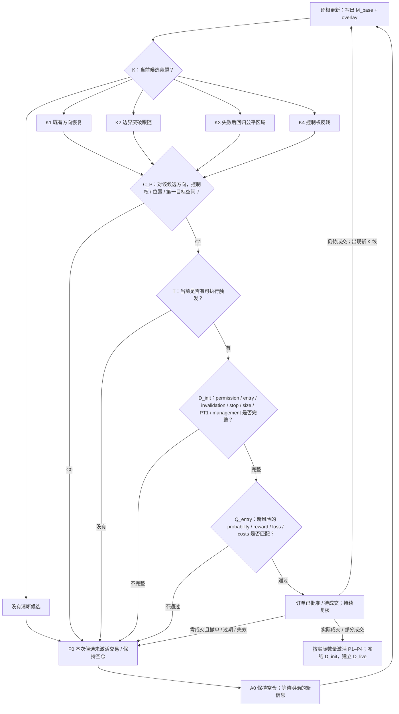
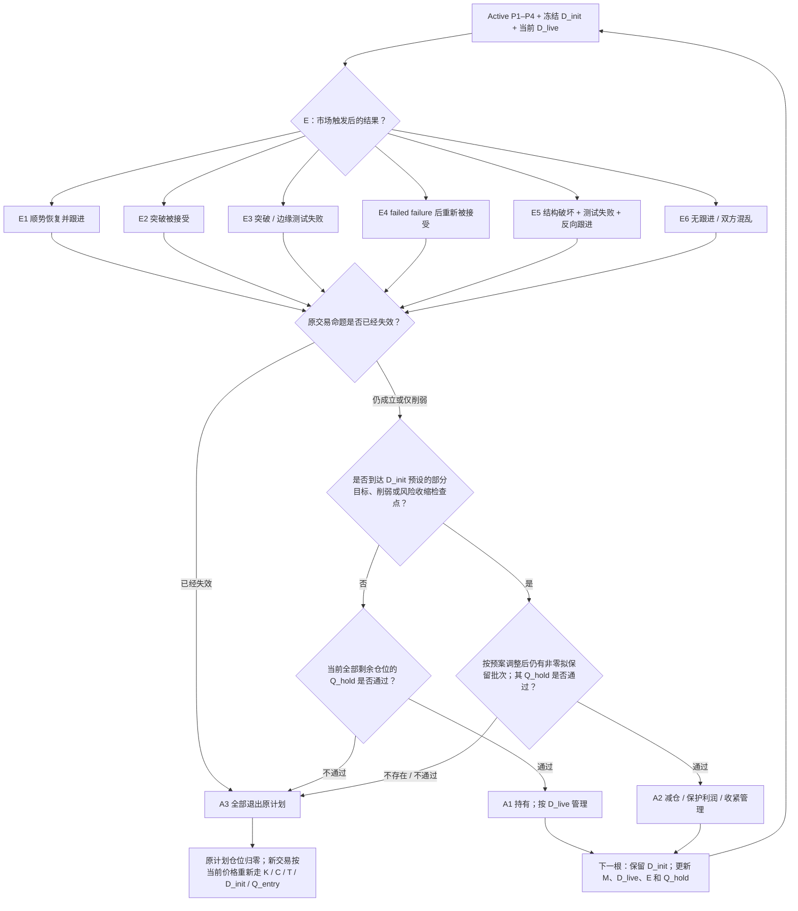

# Brooks 价格行为执行手册

> **状态：Normative**
>
> 本文件是仓库内入场、无效点、止损、目标、仓位、Trader's Equation、管理和退出的唯一执行权威。它是基于 Brooks 资料形成的内部执行政策，不宣称所有编号和路由都是 Brooks 官方术语。官方来源与审计状态见 `reference/official_sources.md` 和 `reference/audit_matrix.md`。

## 文件定位

本文把 market cycle、context、trigger、follow-through、failure、Trader's Equation 和管理方式路由到四类可交易命题，并规定交易从候选、入场到退出的执行边界。学习文档用于解释背景；发生执行冲突时以本文为准。

### 内部记法的作用域

`M/K/C/T/D/Q/P/E/A`、`D_init/D_live`、`Q_entry/Q_hold`、`G1/G2/G3`、`PT1/PT2`、`MaxLoss`、`PlannedLoss`、`OpenRisk` 和 `Cost_hold_delta` 都是本手册拥有的版本化执行记法，不是 Brooks 官方编号。它们只允许被训练、审计和研究文档作为“当前执行模型”引用；`00_method/` 至 `06_trade_management/` 的学习文档只使用稳定的 Brooks 概念和自然语言，不继承这些编号。

因此，未来只重命名层级、调整路由或重构本手册时，不应触发学习文档改写。只有 Brooks 概念、官方证据或其解释本身发生变化时，才同步修改对应学习文档。

本文保留四个 active trade plan：

| 计划 | 不可替代的交易命题 |
| --- | --- |
| P1 趋势延续 | 原方向仍控制市场；当前回调或反方尝试将失败，趋势将恢复。 |
| P2 突破跟随 | 当前离开旧价格区域的尝试将被或已经被市场接受。 |
| P3 边缘失败 / 回归 | 当前边缘测试或突破将失败，价格将回到既有公平区域。 |
| P4 控制权反转 | 原趋势方将失去或已经失去控制，反方将建立可持续的新方向。 |

P0 不是第五个交易计划，而是“本次候选没有激活交易”的结果：可能是某道入场闸门不合格，也可能是合格订单最终在零成交状态下撤销、到期或未成交。A0 是 P0 之后保持空仓和等待的执行状态。已有仓位失效时使用减仓或退出动作，不把持仓机械改名为 P0。

核心执行链分成两段：

```text
入场前：M 市场读取 -> K 候选命题 -> C 候选专属过滤 -> T 当前触发
        -> D_init 初始交易合同 -> Q_entry 入场数学
        Q_entry 通过 -> 订单已批准 / 待成交；实际成交 -> P active
        无 K / C0 / 无 T / D_init 不完整 / Q_entry 不通过 -> P0 / A0
        订单仍有效但尚未成交 -> 保持待成交；撤销、到期或失效且最终未成交 -> P0 / A0
入场后：P + 冻结的 D_init + D_live 实时状态 -> E 市场结果
        -> Q_hold 持仓数学 -> A 持有 / 减仓 / 退出 -> 更新 M 和 K
```

这样可以同时容纳两类合法入场：

- 预判型入场：例如 breakout mode 的初始突破，以及高级权限下的区间边缘 limit entry、早期反转候选。确认较少，必须由更好的价格、风险回报或目标空间补偿。
- 确认型入场：例如突破跟进、回踩守住、收回区间后的 stop entry、完整 MTR。概率通常更高，但入场价格或结构止损可能更差。

## 层级和边界

| 层级 | 只回答什么 | 不负责什么 |
| --- | --- | --- |
| M 市场读取 | 基础 market regime 和当前转换阶段是什么？ | 不直接许可入场。 |
| K 候选命题 | 当前准备验证 P1、P2、P3 还是 P4？方向是什么？ | 不是 active trade plan。 |
| C 候选专属过滤 | 对这个候选方向，控制权、位置和粗略目标空间是否值得继续设计？ | 不能替代基于实际 entry 的 D_init / Q_entry，也不能用一个方向的 C0 否定另一方向候选。 |
| T 当前触发 | 现在可用什么订单或行为入场？ | 不把尚未出现的 follow-through 当成已知事实。 |
| D_init 初始合同 | 具体 entry、命题无效点、protective stop、仓位、目标、管理权限和提前退出条件是什么？ | 成交后不得覆盖原始记录，不能用“入场后再看”替代必填参数。 |
| 待成交订单 | Q_entry 通过后，订单是否仍有效并最终实际成交？ | 通过审查不等于已有仓位；零成交、撤单和失效都不激活 P，部分成交只按实际数量激活。 |
| Q_entry / Q_hold | 入场前完整计划是否值得；成交后从当前价格继续持有是否仍值得？ | 两者不能共用入场价、沉没成本或同一概率。 |
| P active plan | 入场后当前持有的交易命题是什么？ | 一个计划失效不自动证明另一个计划成立。 |
| D_live 实时状态 | 当前仓位、active stop、剩余目标、剩余时间、OpenRisk 和 `Cost_hold_delta` 是什么？ | 只能在 D_init 许可范围内更新，不能改写初始合同。 |
| E 市场结果事件 | 可观察触发后是否跟进、接受、失败或形成二阶失败？ | 与交易者是否成交无关，也不与入场前 trigger 混为一层。 |
| A 执行动作 | 当前是等待、持有、减仓还是退出？ | wait、no-entry 和已有仓位 exit 不是同一状态。 |

所有交易计划都必须在入场前完成 D_init：候选方向、权限、订单与最不利可接受成交边界、命题无效点、protective stop、第一目标、可选延伸目标、初始管理尺度、计划最大损失、适用的 OpenRisk 上限、仓位和提前退出条件。实际成交后冻结 D_init，并另建 D_live。

Brooks 官方 glossary 中，setup 的最低定义只是“由 context 和一根或多根 K 线构成、可作为放置入场单依据的 pattern”；订单成交后，最后一根才成为 signal bar。本手册不改写这个术语，但采用更严格的执行准入：Brooks setup 仍只是候选，若说不出上述 D_init 要素，就不是可批准的交易计划。

## M：基础状态和叠加阶段

Brooks 的公开 manual 先判断 trend 或 trading range；若是 trend，再判断 channel 或 breakout。官方 webinar 进一步把实务结构放在 `breakout -> tight channel -> broad channel -> trading range` 的连续谱上。本文为执行路由把它压缩成基础结构 M1–M3，并把 breakout activity、breakout mode 和 climactic / transition behavior 记为 M4–M6 overlay。M1–M6 是内部政策，不是 Brooks 官方并列分类；尤其 M6 可以在事前记录 climactic behavior，不等同于官方 glossary 中已经反向后的 confirmed climax。

### 基础状态：三选一

| 状态 | 核心含义 | 默认观察重点 |
| --- | --- | --- |
| M1 趋势 / 紧通道 | 一方持续寻找新价格，回调浅，反方失败快。 | K1；离开新边界时观察 K2。 |
| M2 宽通道 / 弱趋势 | 仍有方向，但回调更深，双边交易增加。 | 好位置 K1；通道边缘 K3；结构转换后观察 K4。 |
| M3 交易区间 | 市场围绕公平价格上下测试。 | 边缘 K3；突破 K2；中部无 K -> P0。 |

M2 的识别重点是仍有 higher high / higher low 或 lower low / lower high 的方向性，但回调更深、双边 K 线更多。通道越紧越接近 M1，越宽越接近 M3。

### 叠加阶段：可与基础状态并存

| 阶段 | 最低识别条件 | 之后观察 |
| --- | --- | --- |
| M4 突破尝试 | 价格越过一个有意义的旧边界或价位。 | E2 接受、E3 失败、E4 failed failure 或 E6 无优势。 |
| M5 突破模式 | 任一方向突破都可能获得跟进，但方向尚未被市场选择。 | 双向候选、初始突破、首次突破失败和目标空间。 |
| M6 高潮行为 / 转换 | 原方向出现过快过远、overshoot 或控制权可能转换的组合线索；不要求已满足 confirmed climax。 | 顺势恢复、回到公平区域，或形成 K4 所需的控制权转移证据。 |

M4 的强收盘、连续同向 K 线、gap、较少重叠、follow-through 和回踩守住是突破质量或接受证据，不是 breakout 的最低定义。弱突破也必须保留，因为它可能发展成 E3。

M5 不限于压缩外观。Triangle、tight trading range、ii / iii、ioi、oo 和 barbwire 是常见语言；只要双向突破概率仍存在、方向尚未被接受，就可以保留 M5。压缩发生在清晰 M1 / M2 中且原方向优势仍明显时，它只是趋势中的暂停，不必添加 M5。

M6 不是反转信号，也不是对 confirmed climax 的提前宣判。Climactic behavior 后可以继续趋势；confirmed climax 多数先进入 trading range，只有进一步形成控制权转移证据时才生成 K4。

常见组合写法：

- `M1 + M6`：紧通道仍强，但出现 climactic behavior；先观察顺势恢复还是控制权开始转换。
- `M3 + M5`：区间进一步形成双向 breakout mode。
- `M3 + M4`：区间边缘刚被突破，结果尚未确定。
- `M2 + M4 + M6`：成熟通道出现末端突破，需要同时防延续和失败。

### 阶段标签的生命周期

- M4 从价格越过重要边界开始，保留到突破结果足以重新分类。E2 / E4 后若持续形成单边结构，基础状态更新为 M1；出现更深但仍有方向的回调后更新为 M2。E3 后移除 M4，并回到原基础状态或 M3。E6 时只在突破结果仍未决期间保留 M4。
- M5 在双向突破仍可能获得跟进时保留。一个方向经 M4 / E2 或 E4 被接受后移除 M5；首次突破失败但市场仍保持双向 setup 时可以继续保留；退化为普通、无可交易空间的区间时只记 M3，并路由到 P0 / A0。
- M6 在 climactic behavior 或控制权转换仍未决时保留。原趋势恢复后移除 M6；市场完成区间化时基础状态改为 M3；反方向建立持续通道或趋势时，基础状态改为新的 M2 或 M1。

## K：四个候选命题的判别

同一段价格行为可能支持多个描述。最终归类按“入场时实际下注的命题”和“第一目标”决定，而不是按事后结果重新命名。

| 候选 | 判别问题 | 与相邻计划的边界 |
| --- | --- | --- |
| K1 -> P1 | 我是否在下注既有控制方的回调结束和趋势恢复？ | 如果核心理由变成“一个明确旧边界已被接受”，优先 K2。 |
| K2 -> P2 | 我是否在下注一个明确边界的突破将被或已经被接受？ | 初始突破和确认后入场都是 K2，但确认程度和 Q_entry 不同。 |
| K3 -> P3 | 我是否只期待价格回到既有公平区域？ | 到中轴、均线或近端 swing 的回归，不等于新趋势。 |
| K4 -> P4 | 我是否在下注原控制权转移，并期待反向 swing，通常需要给足 TBTL 的时间和腿数，而不只是回到公平区域？ | 如果只期待 minor reversal 或近端回归，归 K3。 |

P1 和 P2 可以连续发生，但不能因同向而混为一笔计划：旗形内的趋势恢复是 P1；市场随后接受对旧区域的突破时，才产生新的 K2 候选。

这里的“旧边界”必须足以改变价格区域、目标或失效逻辑。仅越过 prospective signal bar、普通旗形或微小回调的局部极值，不会自动把 P1 改成 P2。

P3 和 P4 的分界不靠形态名称。成熟通道边缘的 wedge 先支持回归时是 P3；只有交易命题升级为控制权转移，并具备相应结构、目标和 Q_entry 时，才是 P4。

## C、T、D、Q：交易设计、数学与实时更新

### C：对候选方向分别检查

C 不能在方向产生前做全局 C0 / C1。每个候选都单独回答：

1. 对这个候选，当前控制权或失败行为是否足够？
2. 价格是否处在支持该命题的位置？
3. 到第一现实目标是否仍有足够空间？
4. 附近支撑阻力、大周期目标和时段是否压缩空间？

C 只做粗筛，允许使用预计入场区判断“是否值得继续设计”；具体 entry、stop、PT1 和数学只能在 D_init / Q_entry 中确定。

控制权要求随计划变化：

- P1 通常需要清晰方向性控制；强到 Always In 时概率更高。
- P2 需要突破方向的强度、惯性或接受证据。
- P3 不要求市场已经 Always In 反向；它依赖边缘、失败和回归空间。
- P4 需要原趋势控制被破坏，以及反方向建立持续过程的证据或足够回报补偿早期概率。

一个方向的 C0 只拒绝该方向候选。市场仍要继续观察；新的 E3 / E4 / E5 可以生成反方向候选并重新检查 C。

### T：当前可执行触发

| 触发 | 常见用途 |
| --- | --- |
| T1 顺势恢复触发 | H1 / H2、L1 / L2、旗形、反方 failed entry 后的 stop entry；强趋势 close entry 只属于高级权限。 |
| T2 突破触发 | Breakout mode 初始 stop entry、follow-through 或回踩守住后的再次触发；强突破 close entry 只属于高级权限。 |
| T3 边缘 / 回归触发 | 收回旧区域或 failed entry 后的 stop entry；边缘 limit probe 只属于高级权限。 |
| T4 反转触发 | 趋势结构破坏后的测试失败、二次反转、完整 MTR 的 prospective signal、stop-entry trigger 或确认行为。 |

同一个计划可以有预判型和确认型触发。确认程度不同，概率、入场价格、止损距离和目标空间必须重新进入 D_init / Q_entry。

### D：初始合同与实时状态

D_init 是下单前必须完成的初始合同。官方公开资料支持的核心原则是：按价格行为结构放置 protective stop，仓位随止损距离调整，目标与止损共同进入 Trader's Equation，并在支撑阻力附近考虑部分或全部止盈。本文把这些原则收敛成以下强制模板；字段、命名和风控闸门属于本仓库的内部执行政策。依据见 `SRC-GLOSSARY`、`SRC-STOP-ORDERS`、`SRC-POSITION-SIZE` 和 `SRC-RISK-113`。

| 必填字段 | 下单前必须写清什么 |
| --- | --- |
| `Permission` | 本时段的权限快照；未单列高级项目时一律按基础权限。高级权限必须逐项写明 close entry、limit probe、G1、scale-in 或早期 K4 等具体项目，不能只写笼统的“advanced”。 |
| `Entry` | 方向、订单类型、触发价或预计成交区、最不利可接受成交边界/滑点、预判/确认路线；stop entry 和 protective stop 必须分开写。多头通常约束最高可接受价，空头通常约束最低可接受价。 |
| `Invalidation` | 哪个可观察事实会否定当前 K，而不只是“价格不舒服”。 |
| `Protective stop` | 初始订单价格或结构锚点、允许的最外侧止损边界，以及为何它位于 invalidation 外。 |
| `Risk & size` | `MaxLoss`、适用的 OpenRisk 上限及触发后的预设处置、每单位风险、允许仓位、滑点/手续费估计，以及所有预设加仓后的总风险。 |
| `PT1` | 当前入场方向上第一个明显、现实的目标区域；它必须参与 Q_entry。若使用 measured move，写明被复制的结构与投射起点。 |
| `PT2 / runner` | 可选延伸目标及其成立条件；measured move 同样要写明参照结构与投射起点。没有可靠依据时留空，不能用远端幻想修复不合格的 Q_entry。 |
| `Management` | G1 / G2 / G3、各批次退出比例、移动止损方法和是否附加 TBTL；G 是 D_init 内的配置，不是独立状态层。 |
| `Early exit / time` | 哪些 E、结构变化或时间条件要求 A2 / A3；距离收盘或事件窗口还有多少可用时间。 |

任何必填项无法填写都表示 D_init 不完整，直接 P0。D_init 完整只表示设计可审查，不表示数学合格；随后仍必须通过 Q_entry。

订单实际成交后，D_init 作为审计快照永久保留，不得用后续信息覆盖。D_live 另行记录实际成交均价、剩余仓位、active stop、剩余目标、剩余时间、OpenRisk、`Cost_hold_delta` 和当前管理配置；它可以按预案更新，但不得放宽 D_init 的 outer stop、提高 MaxLoss、补写未授权加仓或把远端目标改成原始依据。

#### 执行权限

权限是时段级风险控制，不由单个 setup 临时授予：

| 权限 | 默认允许 | 默认禁止 |
| --- | --- | --- |
| 基础权限 | Stop entry；G2 / G3；P1、P2、确认型 P3 和完整 MTR。 | G1 scalp、limit probe、close entry / BTC / STC、scale-in、早期 K4。 |
| 高级权限 | 具备相应 D_init、Q_entry 和计划卡条件时，可使用基础权限项目及被单独授权的高级项目。 | 任何未在时段前明确授权的高级项目；“Q_entry 通过”本身不产生权限。 |

退出、减仓和 protective stop 不受入场权限限制。高级权限必须逐项授权，而不是一次性开放所有高级行为；例如允许 close entry 不等于同时允许 scale-in。时段权限记录至少写明项目、适用市场/周期、数量或风险上限和有效时段；没有当期书面记录时退回基础权限。

#### Management：G 和 TBTL

G 是写入 D_init 的初始管理尺度，不是独立状态层：

| 管理 | 使用场景 |
| --- | --- |
| G1 scalp | 仅限单独授权的高级权限。目标近但 Q_entry 仍通过、区间边缘回归、双边波动或确认充分的小目标交易。本仓库不批准 reward 小于 risk 的 scalp；若同一仓位从 entry 到 PT1 的保守毛回报低于从 entry 到 protective stop 的毛损失，P0。 |
| G2 small swing | 有方向优势，但第一目标或结构限制完整 swing；允许在 PT1 部分兑现并保留条件式 PT2。 |
| G3 swing | 强趋势、强突破、完整反转或目标空间足够；至少一部分仓位允许穿越正常 pullback，由结构 trailing 或预设 PT2 管理。 |

TBTL 可以附加在 G2 / G3 上，常用于完整 MTR、final flag 失败、wedge reversal、climactic behavior 后的调整或强突破后的修正。它只提供结构、时间和腿数预期，不是价格目标，也不与 scalp / swing 构成单选枚举。G 和 TBTL 都在 D_init 中预设，成交后只把实际执行状态写入 D_live。

#### 无效点和 protective stop

`Invalidation` 是交易命题被否定的市场事实；`protective stop` 是将该事实转成有限损失的订单。两者相关但不等同：prospective signal bar 的另一端只有在它同时界定命题失败时，才是合格的结构止损。

止损按以下顺序确定：

1. 先写 K 的 invalidation，再找能够代表该失效的结构价位。
2. Protective stop 放在该结构外，并为最小报价单位、正常测试和合理滑点留出必要空间。
3. 如果合理止损太远，缩小仓位、等待更好触发或 P0；禁止把止损塞进正常噪声，只为制造好看的 reward/risk。
4. 下单前锁定最外侧止损边界。入场后不得为了“给交易更多时间”把止损移到该边界之外；预设 wide stop 或 scale-in 时，最外边界和全部仓位风险必须从一开始计入 D_init。
5. 止损只能因新结构形成而向保护利润的方向移动，例如多头在新的有效 higher low 下方、空头在新的有效 lower high 上方。Breakeven 不是固定时间动作；若放在正常回踩路径上，会把有效计划变成无效执行。

Protective stop 被触发或价格已经穿越、出现更早的明确 invalidation，或不存在任何能独立通过 Q_hold 的拟保留部分，都必须 A3。Protective stop 是灾难边界，不要求所有失败交易都等到它成交；但只有客观、预写且可复盘的 early-exit 规则，才可以在 Q_entry 中降低预期损失。

#### `MaxLoss`、仓位和加仓

`MaxLoss` 是这笔交易在 D_init 假设下允许的计划最大账户损失，不由形态吸引力临场放大。它不是成交保证：跳空、停牌、流动性枯竭和异常滑点仍可能让实际损失超过该值，尾部风险必须另由产品选择、账户/时段风险预算和灾难控制承担。本仓库不规定跨账户通用的固定百分比；交易者必须在交易前另行设定账户/时段风险预算。仓位还必须低到能够按计划执行，不会因为担心损失而提前退出，即数学上限和行为上限取较小者。

单次入场先把随数量变化的成本纳入每单位风险，再按市场最小交易单位向下取整：

```text
price_risk_per_unit = |entry - stop| × point_value
variable_cost_per_unit = expected_total_slippage_per_unit + total_variable_fee_per_unit
risk_per_unit = price_risk_per_unit + variable_cost_per_unit
QtyMax = round_down_to_lot_step((MaxLoss - fixed_costs) / risk_per_unit)
```

公式中的风险和成本都换算到账户货币。`fixed_costs` 只扣一次；会随数量增加的手续费和滑点必须进入 `variable_cost_per_unit`，不能先猜一个总额再反推数量。这里的成本按风险路径估计，至少覆盖入场和 protective-stop 退出；若产品还有按笔固定收费，再单列到 `fixed_costs`。`MaxLoss <= fixed_costs` 或向下取整后不足最小交易单位时，直接 P0。

多次入场或 scale-in 必须在下单前按共同的最外侧止损汇总：

```text
PlannedLoss = Σ(qty_i × (|entry_i - stop_outer| × point_value
                         + variable_cost_per_unit_i))
              + fixed_costs
PlannedLoss <= MaxLoss
```

- 未预设的加仓一律视为新风险，不能用“改善均价”绕过 `MaxLoss`。
- 最小可交易单位已经超过 `QtyMax` 时，结果是 P0，不允许用过紧止损迁就仓位。
- 实际成交价或数量偏离 D_init 时，立即按真实 fill 重算 PlannedLoss。若只是不满足 `MaxLoss`，取消未成交余单，并在拟保留仓位的 Q_hold 仍通过时立刻减至合格数量；若实际 fill 越过最不利可接受成交边界、破坏原设计，或拟保留仓位的 Q_hold 不通过，则 A3。仓位缩小只能修复金额上限，不能修复每单位负期望。
- 持仓后用 `OpenRisk` 表示从当前可执行退出基准到 active stop 的前瞻风险/利润回吐暴露：`remaining_qty × adverse_distance(current_exit_reference, active_stop) × point_value`；多头的不利距离是 `current_exit_reference - active_stop`，空头是 `active_stop - current_exit_reference`，有效持仓时两者都不得为负。价格已经越过 stop 却仍未退出属于执行异常，应立即 A3，而不是取绝对值继续计算。继续持有相对立即退出的增量成本另列为 `Cost_hold_delta`，不得与 OpenRisk 重复。OpenRisk 显著扩大时，按预案处理风险，或在新结构允许时推进止损；不能因为已有浮盈就忽略当前暴露。具体开放风险上限在时段风险预算中预设。
- 新 pullback 形成更近且有效的结构止损后，可以更新剩余仓位的 D_live。同一品种仍有 active plan 时，任何新增同向数量无论如何命名都按 scale-in 处理，必须已在原 D_init 中逐层预设并计入总 `MaxLoss`；新增反向数量则必须先以 A3 让原计划归零。未预设的新数量只能在原计划结束后，作为新候选重新完成 K / C / T / D_init / Q_entry；不能借“新信号”或“新计划”绕过风险上限。

#### `PT1`、延伸目标和时间

目标是区域，不是保证成交的精确点。`PT1` 是从预计 entry 出发，沿交易方向遇到的第一个明显且现实的兑现区域；常见依据是前 swing、高低点、区间公平区域、突破点、均线、缺口、重要支撑阻力或其他 magnet。若最近障碍使 reward 不足，正确结果通常是等待更好价格或 P0，而不是跳过它改用更远目标。

- P1 / P2 的 measured move 若在入场时已有结构依据，且确实是沿交易方向遇到的第一个明显目标，可以列为 `PT1`；存在更近障碍或仍需后续接受证据时，只能列为条件式 `PT2`。不能按名称机械归类，也不能用 measured move 跳过更近目标。
- 合格的 measured move 必须能指出被等量复制的腿、区间/形态高度、日内 gap 或 breakout height，并写明投射起点；“大概还能走一段”不是目标依据。
- P3 的 `PT1` 是回到既有公平区域；另一侧边缘只能是条件式 `PT2`。
- P4 可以在近端障碍部分兑现，但完整命题必须仍有反向 swing 的现实空间；如果全部计划只到公平区域，它应归 P3。
- G3 runner 可以没有固定最终限价单，但 Q_entry 必须给它保守、有限的回报估计；“无限上涨/下跌”不得进入数学。
- 部分止盈必须预写比例。Q_entry 使用各批次的概率加权或保守情景回报，不能把全仓同时按 PT1 和 PT2 重复计算。
- TBTL 只提供时间和腿数预期，不是价格目标；measured move 只提供目标候选，不保证到达。
- 价格空间足够但剩余时间不足时，D_init 或 Q_entry 仍不通过。入场后时间耗尽、目标被新结构阻断或到达预设时段边界时，重新计算 Q_hold；拟保留部分仍通过且符合预案时才可 A2，否则 A3。

目标可以在新信息出现后缩短，止损也可以按新结构推进；这些变化只写入 D_live，D_init 保留原值。若拟保留部分在合法调整后 Q_hold 仍不通过，应全部退出。禁止把 PT1 临时拉远，或把 protective stop 临时放宽，来证明原入场“其实合理”。

### Q：入场数学与持仓数学

Q_entry 和 Q_hold 回答两个不同问题，不能互换输入。

#### Q_entry：是否值得承担新风险

Q_entry 对完整 D_init 做下单前闸门，而不是只看一个 reward/risk 比值。最简二结果近似为：

```text
EV_entry = p × W - (1 - p) × L - Cost_entry > 0
```

其中：

- `W` 是计划成功时的保守毛回报，`L` 是按 protective stop 或已验证 early-exit 规则计算的毛损失，`Cost_entry` 是预计完成整笔交易所需、但尚未嵌入成交价格的手续费、点差和滑点；三者必须使用同一单位。若 entry、target 或 stop 已使用含价差/滑点的预期可执行价格，相同成本不得在 `Cost_entry` 再扣一次。
- `p` 必须对应当前 entry、stop、目标和管理版本。预判与确认路线、PT1 与 PT2、scalp 与 swing 都不能共用一个脱离语境的概率。
- 多目标、scratch 和 early exit 明显影响结果时，改用 `Σ(probability_i × outcome_i) - Cost_entry`，而不是假设只有全赢或全亏。各情景必须互斥且穷尽、概率合计为 1，`outcome_i` 统一使用带正负号的毛账户盈亏；不能把同一仓位到达 PT1 和 PT2 同时算成两个独立成功结果。
- 没有可靠校准时，按保守概率区间而非伪精确小数评估。官方 glossary 的通用指引是：不确定时按约 40–50% 并寻求至少约 2 倍风险的潜在回报；高置信度交易可以用较小 reward/risk，但高概率通常也伴随更远止损或更差价格。该指引不是每个 setup 的固定胜率。
- G1 / G2 / G3、部分退出比例和 TBTL 必须在 D_init 中先确定，因为它们会改变 `W`、`L`、`Cost_entry` 和可执行概率。

若概率无法合理分档、`EV_entry <= 0`、对小幅假设变化极其敏感，或计划只有依靠完美 discretionary exit 才成立，则 Q_entry 不通过。合理止损太远、PT1 太近或入场价格太差时，可以等待并从 T / D_init 重算；改变管理名称本身不能修复不合格的 Trader's Equation。

#### 订单批准、撤销与成交

Q_entry 通过只表示订单可以提交或保留，不表示 P 已激活。订单待成交期间，每根新 K 线都要检查 M、K、C、T、最不利可接受成交边界、剩余时间和 Q_entry：

- 候选失效、触发条件消失、价格越过最不利可接受成交边界、时间到期或 Q_entry 不再通过时，立即撤单。若仍是零成交，则记录 P0 / A0；若已有部分成交，只撤未成交余单，已成交部分继续按 Q_hold 和 A 处理，其中原命题已经失效时直接 A3。
- 实际成交才激活 P，并以真实 fill 建立 D_live。Market / close entry 可能让“批准—成交”几乎同时发生，但逻辑边界仍然存在。
- 部分成交只按实际数量激活 P。已成交部分立即进入 D_live / Q_hold；未成交余单仍按 D_init / Q_entry 管理，并继续占用同一笔交易的风险预算。汇总 PlannedLoss 时，已成交部分使用真实 fill，未成交余单使用 D_init 的最不利可接受成交边界和共同 outer stop。
- 实际 fill 后立即按真实价格和数量重算 PlannedLoss 与首次 Q_hold。若 PlannedLoss 超过 MaxLoss，先取消余单；只有拟保留仓位本身 Q_hold 通过时，才可减至合格规模。实际 fill 越过最不利可接受成交边界、原设计已失效或 Q_hold 不通过时，直接 A3。

#### Q_hold：从当前价格继续持有是否值得

成交后不再用入场价和已经支付的成本重复证明持仓。Q_hold 比较“继续持有”与“现在退出”，使用当前可执行价格、active stop、剩余目标、当前 E 和增量持有成本做前瞻判断：

```text
EV_hold = p_remaining × W_remaining
          - (1 - p_remaining) × OpenRisk
          - Cost_hold_delta > 0
```

- `W_remaining` 是从当前可执行退出基准到剩余目标的保守毛回报；`OpenRisk` 是从该基准到 active stop 的前瞻毛损失/利润回吐暴露。
- `Cost_hold_delta = max(0, expected_exit_cost_if_held + financing_or_borrow_cost - cost_to_exit_now)`。现在退出也要付出的共同成本不能只扣在持有方案上；若价差和滑点已经反映在 `W_remaining` / `OpenRisk` 的可执行价格中，也不得在这里重复扣除。
- `W_remaining`、`OpenRisk` 和 `Cost_hold_delta` 必须对应同一拟保留仓位并使用同一单位。
- 已实现盈亏、原 entry 和已支付成本属于记录与账户约束，不进入“现在是否继续持有”的前瞻比较；D_live 仍必须同时记录若 stop 成交后的总账户结果和 MaxLoss 合规性。
- `p_remaining` 必须根据当前 M、E、剩余时间和目标重新评估，不能沿用入场概率。
- 多目标、部分仓位和提前退出显著影响结果时，使用拟保留仓位的互斥且穷尽的多结果期望，概率合计为 1；不把已平仓部分再次计入，也不重复计算同一路径上的多个目标。

Q_hold 针对“拟保留批次”计算。A2 只在 D_init 已预设部分兑现/风险收缩，或不同批次的目标和管理确实不同，而且拟保留批次自身 Q_hold 通过时成立；否则执行 A3。对同质仓位按比例减仓会同比缩小 reward 和 risk，不能把负的每单位期望变成正值。也不能用放宽 stop、拉远目标或引用原交易利润来保留负的前瞻期望。

## E：结果事件索引

E 只记录可观察市场触发后的结果，不承担入场前 trigger，也不要求交易者已经成交。同一个 E 可以在空仓时生成新候选、在待成交时导致保留或撤单、在持仓时改变 Q_hold 和 A。

| 事件 | 可观察含义 | 常见作用 |
| --- | --- | --- |
| E1 顺势恢复并跟进 | 原方向触发后有连续性，回调方再次失败。 | 支持 P1；也可能发展成新的 M4 / K2。 |
| E2 突破被接受 | 强收盘、follow-through、回踩守住或反方无法快速收回。 | 支持新的 K2。 |
| E3 突破 / 边缘测试失败 | 触发后缺乏跟进并快速回旧区域。 | 支持新的 K3，或恢复 M3。 |
| E4 Failed failure | 先交易 failure 的一方也失败，随后重新突破并被接受。 | 支持新的 K2。 |
| E5 控制权转移确认 | 趋势结构破坏、原方向测试失败、反向跟进形成组合。 | 支持新的 K4；“完整 MTR”是 setup，不是单一事件名。 |
| E6 无跟进 / 混乱 | 双方都没有形成可交易优势。 | 空仓时 P0 -> A0；持仓时按命题状态和 Q_hold 决定 A1 / A2 / A3。 |

E 的方向含义必须相对当前候选或 active plan 判断。同一个 E3 对 P2 是失效证据，对等待反向回归的交易者则只是新的 K3 证据。

## A：执行动作

| 动作 | 含义 |
| --- | --- |
| A0 wait / no-entry | P0 后保持空仓，或零成交的待成交订单被撤销/过期；等待新的 M、K、T 或 E 证据，再重建 D_init / Q_entry。 |
| A1 hold | Active plan 仍成立且 Q_hold 通过，按 D_live 持有。 |
| A2 reduce | 到达预设部分目标、命题削弱或风险预算要求收缩；只有 D_init 允许，且拟保留批次的 Q_hold 通过时，才按预案减仓、保护利润或收紧管理。 |
| A3 exit | 命题失效、Q_hold 不通过、到达计划终点或时间条件不再允许持仓；退出该计划管理的全部仓位。 |

A3 表示原交易命题已经终止，并要求该计划管理的仓位归零；不得把剩余仓位直接过户到另一个计划。之后的新交易必须按当前价格完整重跑 K / C / T / D_init / Q_entry，实际重新成交后才激活新的 P。P1 失效不自动证明 P4，P2 失效也不自动证明 P3。

## 入场前选择图



E 是可观察市场触发后的结果，与交易者是否成交无关。空仓或待成交时观察到 E1–E6，只会更新候选证据或订单有效性；必须回到 K / C / T / D_init / Q_entry，不能从 E 直接跳成 active plan。

## 入场后更新图



A2 只用于管理已有风险，不表示原交易数学可以事后被修复。拟保留批次若不能独立通过 Q_hold，应 A3；对同质仓位机械缩小数量不会改变每单位期望的正负。

## 权威路由矩阵

以下矩阵是“市场读取 / 结果事件 -> 候选或 P0”的规范映射。它不直接生成 active plan；后面的场景和形态表只提供应用示例，若有歧义以本矩阵为准。

| 当前读取或结果 | 路由结果 | 仍需确认 |
| --- | --- | --- |
| M1；回调浅；反方失败 | K1 | 好位置、T1、第一目标空间和 Q_entry。 |
| M1 / M2 中顺势突破明确旧边界 | K2 | 初始突破质量、E2 / E3、结构止损和 Q_entry。 |
| M2 好位置顺势恢复 | K1 | 原方向控制仍在，不能在宽通道边缘追随。 |
| M2 宽通道边缘测试失败 | K3 | 回归目标、反向行为、完整 D_init 和 Q_entry。 |
| M2 结构破坏 + 原趋势测试失败 | K4 | 是否真在下注控制权转移，而非近端回归。 |
| M3 清晰边缘 | K3 | 选择预判或确认路线，完成 D_init 和 Q_entry。 |
| M3 中部 | 无 K -> P0 | 除非强 surprise、有效突破或大周期位置改变候选。 |
| M5 初始突破 | K2 | 预判路线概率较低；必须用价格和目标空间补偿。 |
| M4 + E2 | K2 | 对突破方向重新检查 C / T / D_init / Q_entry。 |
| M4 + E3 | K3 | 对回归方向重新检查 C / T / D_init / Q_entry。 |
| M4 + E4 | K2 | failed failure 是否真的重新被接受。 |
| M6 + 顺势恢复 | K1 | Climactic behavior 不妨碍趋势继续，但 Q_entry 必须考虑差入场。 |
| M6 + 只回到公平区域 | K3 | 按 minor reversal / 回归目标，不幻想新趋势。 |
| M6 + E5 | K4 | 可量化的反向 swing 空间、完整 D_init / Q_entry，以及适用时的 TBTL 预期。 |
| E6 双方无优势 | 无 K -> P0 | 等待新的边缘、突破、失败或控制权证据。 |

## 四个交易计划

四张计划卡只定义各计划的 D_init 参数锚点、初始 management 和有利/不利证据，不直接规定 A1–A3。所有入场后动作统一由后文“Active plan 更新矩阵”决定，避免在多处维护同一退出规则。

### P1. 趋势延续

**命题**

既有方向仍控制市场；当前回调或反方尝试将失败，趋势将恢复。

**适用 M / K**

- M1；M2 中仍有方向且位置良好。
- K1 的核心理由是原控制方恢复，不是一个新边界已经被接受。

**C 和 T**

- 控制权清晰；强到 Always In 时概率更高，但弱通道也可在好位置形成候选。
- 回调没有破坏原趋势结构，反方信号缺乏跟进或快速失败。
- 常见 T1 包括 H2 bull flag / L2 bear flag、double bottom bull flag / double top bear flag、wedge pullback、小回调趋势和反方 failed entry。
- 基础权限使用 stop entry 等待趋势恢复；高级权限可在强趋势使用 close entry 或 Buy The Close / Sell The Close，但必须为更差价格重跑 D_init / Q_entry。

**D_init 计划参数**

| 字段 | P1 默认规则 |
| --- | --- |
| Entry | 基础权限优先在 T1 用 stop entry 等待原方向恢复；高级权限的强趋势 close entry / BTC / STC 必须在提交前按保守预计成交价和最不利可接受成交边界完成 D_init / Q_entry。实际 fill 后不得重写 D_init，统一按成交规则建立 D_live、重算 PlannedLoss 和 Q_hold。 |
| Invalidation | 回调或旗形不再只是原趋势中的暂停，原控制方恢复命题被结构破坏或强反向跟进否定。 |
| Protective stop | 放在回调结构、旗形失败点或定义 K1 的 swing 外；prospective signal bar 另一端只有在它足以代表该失效时才可使用。 |
| Risk & size | 按完整结构止损距离反推仓位；不得因趋势看起来很强而放大 `MaxLoss`。未预设的回调加仓不允许。 |
| PT1 | 前高/前低、前 swing、日内高低点、已有依据的第一 measured move 或最近明显 magnet 中最先遇到的现实区域。 |
| PT2 / runner | 只有趋势强、回调浅且 E1 持续时，才启用更远的前一腿、spike 或旗形 measured move；G3 runner 用结构 trailing stop。 |
| Initial management / weakening evidence | 强趋势且空间足够用 G3；弱通道可用 G2。反方强突破、回调破坏结构、E1 缺失或剩余空间收缩属于削弱/失效证据；若只有跳过近端障碍或把远端 PT2 冒充 PT1 才能通过，Q_entry 不通过。 |

### P2. 突破跟随

**命题**

市场正在离开一个明确旧价格区域，这次突破将被或已经被市场接受。

**适用 M / K**

- 任一基础状态叠加 M4；M5 的双向初始突破。
- 常见突破对象包括交易区间、开盘区间、前高前低、趋势线、通道线、缺口和大周期支撑阻力。

**C 和 T**

- 预判路线：breakout mode 的初始 stop entry，或高级权限下强 breakout bar 的 close entry。确认较少，Q_entry 必须用更好的入场、较大目标空间或可接受概率补偿。
- 确认路线：follow-through、回踩守住突破点、反方无法收回，或 E4 failed failure 后再次触发。概率通常更高，但价格和止损可能更差。
- Surprise 和 inertia 支持再次测试突破方向，但不能替代 E2。

**D_init 计划参数**

| 字段 | P2 默认规则 |
| --- | --- |
| Entry | 基础权限可用 breakout-mode stop entry；强 breakout close 需要高级权限。确认路线用 follow-through、回踩守住或 E4 后的新触发；每换路线都重算 D_init / Q_entry。 |
| Invalidation | 市场没有接受新价格：突破缺乏跟进、快速收回旧区域，或回踩明确跌回/升回突破点内并获得反向跟进。 |
| Protective stop | 初始突破放在定义突破失败的结构外；回踩版本放在回踩结构和突破点失守位置外。止损过远时等待回踩或 P0。 |
| Risk & size | 按完整 breakout / retest stop 距离反推仓位；强突破的高概率不能覆盖过大计划损失。追入后不得沿用较早、更好价格下的 Q_entry。 |
| PT1 | 下一处明显支撑阻力或 magnet；若已有依据的 measured move 本身就是第一目标，可使用它，但不得越过更近障碍。 |
| PT2 / runner | E2 / E4 持续且空间足够时，才启用更远的区间、开盘区间、breakout leg 或 spike measured move。 |
| Initial management / weakening evidence | 跟进强且空间足够用 G3；G1 只允许高级权限且仍需 Q_entry 通过，其他近目标版本使用 G2。E3、快速回旧区域、反向 surprise 或剩余空间不足属于削弱/失效证据；不能用“降级为 scalp”修复不合格的数学。 |

### P3. 边缘失败 / 回归

**命题**

市场正在测试区间边缘、宽通道边缘、缺口或重要目标；这次离开旧公平区域的尝试预计不会被或已经没有被接受，价格将回到既有公平区域。

**适用 M / K**

- M3 边缘、M2 宽通道边缘、M4 + E3、M5 首次突破失败。
- K3 的目标只是旧公平区域，不假设反方已经建立新趋势。

**C 和 T**

- 价格必须在有意义的边缘；区间中部的 H2 / L2、double top / bottom 或小 wedge 通常不是候选。
- 所有路线都要求到中轴 / 前 swing 有合理空间；一旦出现明确 E2，K3 失效。
- 高级权限的预判路线：成熟 M3 或宽 M2 的清晰边缘尚未被市场接受时，可以在 E3 出现前使用 limit probe。必须预先定义仓位、结构无效点和 `MaxLoss`；wide stop、scale-in 只在逐项授权并选择相应版本时预先写入。
- 基础权限的确认路线：等待 E3、收回旧区域、failed entry、反向强度或被困交易者后使用 stop entry。确认更充分，但入场可能更差。

**D_init 计划参数**

| 字段 | P3 默认规则 |
| --- | --- |
| Entry | 高级权限的预判版本只用于成熟宽区间/宽通道的清晰边缘，可用小仓 limit probe；基础权限的确认版本等待 E3、收回旧区域或 failed entry 后用 stop entry。 |
| Invalidation | 边缘或突破不再失败，而是价格离开旧公平区域并出现 E2；“再走一点也许回来”不保留 K3。 |
| Protective stop | 放在失败突破极值或边缘结构的最外失效点外。Wide-stop 版本必须从开始就使用该 outer stop，不能入场后再放宽。 |
| Risk & size | 默认单次小仓。Scale-in 需要单独的高级权限，只允许在成熟、足够宽的区间且层级、outer stop、总数量和 `MaxLoss` 全部预写时使用；紧区间和区间中部禁止。 |
| PT1 | 中轴、均线、前 swing 或最近支撑阻力中最先代表旧公平区域的目标。Measured move 可以提供汇合依据，但不能替代公平区域或借此把 P3 目标延伸成反转 swing。 |
| PT2 / runner | 只有反向强度和剩余空间都足够时，才把另一侧边缘列为 PT2；若命题升级为控制权转移，必须另建 P4。 |
| Initial management / weakening evidence | 基础权限默认 G2；高级权限才可使用 G1。到达公平区域、E2、反方向持续跟进、时间不足或剩余空间不足是兑现、削弱或失效证据。控制权转移只能生成新的 K4，原 P3 不得直接改名或保留仓位过户。 |

### P4. 控制权反转

**命题**

原趋势方将失去或已经失去控制，反方将建立可持续的新方向。P4 下注的是控制权转移，不只是 minor reversal。

**适用 M / K**

- 成熟趋势、M6、趋势结构破坏、原趋势恢复尝试失败和反向持续压力。
- Climactic behavior、confirmed climax、wedge、final flag 和 exhaustion 行为只提供背景，不能单独生成 P4。

**两条入场路线**

- 高级权限的早期 K4：已经出现有意义的趋势结构破坏或异常强反向 surprise，交易者在完整确认前下注控制权转移。概率较低，必须有可量化的反向 swing 价格目标使 Q_entry 通过；TBTL 只能在数学合格后作为时间和腿数预期附加，不能用小 scalp 目标掩盖低概率。
- 基础权限的完整 MTR：反向运动突破原趋势线或通道结构，原趋势回探旧极值失败，形成 higher high / lower high / double top，或 lower low / higher low / double bottom 等测试，并出现反向触发或跟进。

如果结构尚不完整且第一目标只到均线、区间中轴或旧公平区域，应归 P3 / minor reversal candidate，而不是 active P4。

**D_init 计划参数**

| 字段 | P4 默认规则 |
| --- | --- |
| Entry | 高级权限的早期版本只在结构破坏或异常强反向 surprise 后使用；基础权限的完整版本等待原趋势测试失败和反向 prospective signal / follow-through。两者是不同 D_init / Q_entry。 |
| Invalidation | 原趋势恢复并重新建立控制，或失败测试的极值被有效突破，使控制权转移命题不再成立。 |
| Protective stop | 放在回探失败极值或完整反转结构被否定的位置外；早期版本不得用过紧 prospective-signal-bar stop 掩盖更远的真实失效点。 |
| Risk & size | 早期版本按较低概率和完整 swing stop 缩小仓位；完整 MTR 仍受同一 `MaxLoss` 约束。任何反转加仓必须作为预设层级写入 D_init。 |
| PT1 | 均线、前 swing、区间中轴、原突破点或其他最先遇到的障碍，可预设部分兑现。 |
| PT2 / runner | 必须存在可量化的反向 swing 空间；若 PT1 只是近端公平区域，通常还需要反向 swing 的 PT2 / runner。若第一个现实目标本身已经代表反向 swing，则 PT2 可留空。E5 持续时可用 measured move 或结构 trailing；TBTL 只说明时间/腿数。若全部目标只到公平区域，归 P3。 |
| Initial management / weakening evidence | 早期 K4 只有 swing 数学合格才允许提交订单；完整 MTR 用 G2 / G3，可附 TBTL。原趋势强恢复、反向无跟进、只形成小区间或剩余空间不足属于削弱/失效证据。 |

### P0. 本次候选未激活交易

P0 是 no-entry 结果，不是 active trade plan。它区分“入场闸门不合格”和“设计合格但订单最终未成交”两类原因；后者不是执行错误。

常见原因：

- 没有清晰 K，或多个候选无法排序。
- C0：对该候选方向，控制权、位置或第一目标空间不支持。
- 没有当前可执行的 T。
- D_init 不完整：permission、entry、invalidation、protective stop、size、PT1、management 或提前退出条件任一项不清楚。
- Q_entry 不通过：D_init 完整，但概率、回报、损失和成本组合后的期望仍不合格。
- 区间中部、barbwire、tight trading range 或目标空间太小。
- 合理止损太远、剩余时间不足、流动性差或大周期目标压缩空间。
- 需要堆很多理由才能证明交易成立。
- Q_entry 通过，但订单随后在零成交状态下撤销、到期、失效或在有效期内未成交。

P0 后继续观察 M 和 E。强突破、边缘失败、failed failure 或反向跟进只会生成新 K，仍需重新走 C / T / D_init / Q_entry。

## Active plan 更新矩阵

这是 active plan 从 E / Q_hold 到 A 的唯一权威更新表。计划卡只提供证据和初始参数；所有“转到其他计划”都表示先以 A3 退出原计划，再按当前价格回到 K / C / T / D_init / Q_entry。

| Active plan | 有利结果与动作 | 不利结果与动作 | 原命题终止后的路由结果 |
| --- | --- | --- | --- |
| P1 | E1、浅回调、目标空间仍足够且 Q_hold 通过：A1；命题削弱或到部分目标，且拟保留批次的 Q_hold 通过：A2 | 原趋势恢复命题失效，或拟保留批次的 Q_hold 不通过：A3 | E2 后 K2；E5 后 K4；否则等待新 K |
| P2 | E2、E4、回踩守住、持续远离旧区域且 Q_hold 通过：A1；跟进削弱或到部分目标，且拟保留批次的 Q_hold 通过：A2 | E3、快速回旧区域、反向强突破，或拟保留批次的 Q_hold 不通过：A3 | E3 后 K3；形成小回调趋势后 K1；控制权转移时 K4；否则等待新 K |
| P3 | E3 后向公平区域推进且 Q_hold 通过：A1；到 PT1 时按 D_init 兑现——无 runner 则 A3，有 runner 且拟保留批次的 Q_hold 通过则 A2 | 重新突破并被接受、回归命题失效，或拟保留批次的 Q_hold 不通过：A3 | E2 后 K2；完整控制权转移后 K4；无 K 时 P0 |
| P4 | E5、反向 follow-through、原趋势恢复再次失败且 Q_hold 通过：A1；反向推进削弱或到部分目标，且拟保留批次的 Q_hold 通过：A2 | 原趋势强恢复、反向压力不足、只形成小区间，或拟保留批次的 Q_hold 不通过：A3 | K1；反向突破被接受后 K2；无 K 时 P0 |

## 叠加场景和形态路由

时段、缺口、交易日类型和形态语言不是独立策略。它们只改变 M、候选概率、目标和跟进要求。以下是规范路由矩阵的应用示例，不新增映射规则。

| 场景 | 先更新什么 | 路由示例 |
| --- | --- | --- |
| Trend from the open | M1、早期目标空间和反方失败 | K1；突破新边界时 K2 |
| Opening range breakout | M4 和突破结果 | E2 -> K2；E3 -> K3 |
| Opening reversal | 早期运动的位置、失败和反向强度 | 只回公平区域为 K3；控制权转移为 K4 |
| Gap accepted | M4、缺口方向跟进和回补失败 | K2；形成趋势后 K1 |
| Failed gap | E3、被困缺口交易者和回归空间 | K3；若反转成熟再 K4 |
| Exhaustion gap | M6 背景，不直接生成交易计划 | 先看 minor reversal / K3；满足 E5 后才 K4 |
| Trading range day | M3、边缘和中部 | 边缘 K3；中部 P0 |
| Reversal day | 原运动被否定后的目标和控制权 | K3 或 K4，按交易命题区分 |
| Breakout day | M4、接受和 measured move 空间 | K2；后续小回调趋势 K1 |

收盘前还要检查剩余时间。入场前目标合理但时间不足时重算 Q_entry；持仓后时间减少时重算 Q_hold。不能只把 swing 临时改成 scalp。

同一个形态必须按候选命题解释：

| 形态语言 | 趋势 / 通道环境 | 区间环境 | 转换环境 |
| --- | --- | --- | --- |
| H2 / L2 | 可作为 K1 的 T1 | 中部通常 P0；边缘失败可支持 K3 | Failed H2 / L2 可形成 K3 或 K4 的证据 |
| Wedge | Wedge pullback 可支持 K1 | 边缘三推可支持 K3 | 结构和目标支持控制权转移时才 K4 |
| Double top / bottom | 可是 bull / bear flag | 边缘第二次测试失败可支持 K3 | 旧极值测试失败是完整 MTR 的组件 |
| Final flag | 趋势仍强时只是整理 | 可能只是小区间 | 顺势突破失败后先观察 M6 / E5 |
| Triangle / ii / ioi / oo | 可能是趋势暂停 | 常见 M5，但 M5 不限于这些外观 | 首次突破失败可形成 E3 / E4 |
| Gap | Body / micro gap 可显示惯性 | 边缘无跟进可形成 E3 | Exhaustion gap 只提供 M6 背景 |
| Trend bar | 连续性支持控制权 | 边缘强 K 线可能只是 vacuum test | 单根反向 K 线只是尝试，需后续结果 |

## 逐根更新规则

每根 K 线后按空仓、待成交和持仓三组问题复核。它们不是永远互斥：部分成交时，已成交部分属于持仓，未成交余单仍属于待成交，两组问题必须同时执行。

空仓时：

1. 基础 M1–M3 是否改变？是否要添加或移除 M4–M6？
2. 当前最清晰的 K 是什么，方向是什么？
3. 该候选的 C、当前 T、完整 D_init 和 Q_entry 是否同时合格？
4. 不合格时记录 P0、保持 A0，并说明等待什么具体新信息？

有待成交订单时：

1. M、K、C 和 T 是否仍支持原订单？
2. 当前价格是否仍在最不利可接受成交边界内，剩余时间和 Q_entry 是否仍通过？
3. 条件不再满足时是否立即撤单，而不是等待“也许会回来”？
4. 实际成交后是否冻结 D_init，并用真实 fill 建立 D_live？

持仓时：

1. 触发后出现了哪个 E，原交易命题是否仍成立？
2. D_live 中的 active stop、剩余目标、剩余时间、OpenRisk 和 `Cost_hold_delta` 是否准确？
3. Q_hold 是否通过；按预设 management 和更新矩阵应 A1、A2 还是 A3？
4. 如果原计划失效，先以 A3 让原计划仓位归零；新候选再从 K / C / T / D_init / Q_entry 开始。

派生训练材料从 [README 的训练入口](README.md#快速入口)进入。任何时候都不要用新的形态名称替代候选命题、无效点、目标和交易数学。
