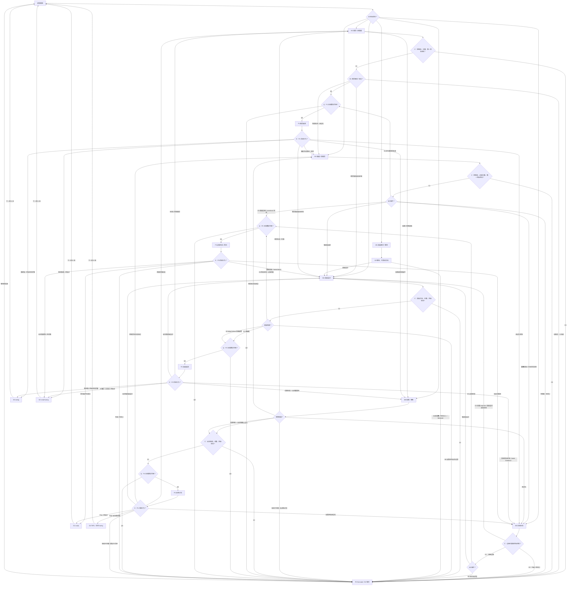

# 策略分支总图

## 总结结论

Brooks 的策略分支不是形态清单，而是从当前市场状态推导出的交易方式选择：

```text
M: Market state
-> C: Control / Location / Target filter
-> E: Event / confirmation
-> Q: Trader's Equation
-> P: Trade plan
-> G: Management
```

本文只把五类命题作为一级交易计划：

| 计划 | 不可替代的核心 |
| --- | --- |
| P1 趋势延续 | 原方向仍控制市场，回调或反方尝试失败后，趋势恢复。 |
| P2 突破延续 | 市场离开旧价格区域，并被接受。 |
| P3 边缘失败 / 回归 | 市场测试边缘或突破失败，价格回到旧公平区域。 |
| P4 反转计划 | 原趋势方失去控制，反方尝试建立新方向。 |
| P0 No-trade | Trader's Equation 不合格，或分支不清楚。 |

其他编号只说明层级、环境、事件或管理方式，不增加新的一级交易计划。

## 层级和去重规则

所有分支都必须回答同一组问题：在哪里触发，在哪里证明错误，第一目标在哪里，按 scalp、small swing、swing、TBTL 还是 no-trade 管理。

如果一个分支只能说出形态名称，却说不出触发、无效点、目标和管理方式，它仍然只是 pattern，不是 setup。

| 层级 | 作用 | 编号 |
| --- | --- | --- |
| M 市场状态 | 判断当前 market cycle | M1 趋势 / 紧通道；M2 通道 / 弱趋势；M3 交易区间；M4 突破；M5 突破模式 / 交易区间式等待；M6 高潮 / 转换 |
| C 过滤层 | 判断 Always In / 控制权、位置和第一目标空间 | C1 控制权和位置支持交易；C0 位置差、目标近或控制权不清 |
| E 确认事件 | 判断触发、跟进、失败和被困交易者 | E1 顺势恢复；E2 突破被接受；E3 突破 / 边缘测试失败；E4 failed failure；E5 转换 / 反转确认；E6 无跟进 / 混乱 |
| Q 交易数学 | 判断概率、风险、回报和成本是否匹配 | Q1 合格；Q0 不合格，转 P0 |
| P 交易计划 | 决定是否交易以及交易什么 | P1 / P2 / P3 / P4 / P0 |
| G 管理方式 | 决定出场、持有和目标 | G1 scalp；G2 small swing；G3 swing；G4 TBTL；G0 wait / exit / no-trade |

去重规则：

- M 只保留市场状态，不是入场许可。
- C 和 Q 是过滤层，不单独形成交易计划。
- E 只保留结果事件，不是独立交易计划。
- P 只保留不可替代的交易命题：顺势、突破、失败回归、反转和 no-trade。
- G 只保留管理方式，不反过来证明 setup 成立。
- `M2 / P1`、`M2 / P3` 是 `P1`、`P3` 在通道环境中的版本。
- `E4` 是进入 `P2` 的事件路线，不是单独计划。
- `P2.3 surprise 后第二腿` 是 `P2` 成立后的管理和目标调整。
- `P0` 是不形成交易计划的判断；`G0` 是等待、退出或不持仓的执行状态。

Breakout 在 Brooks 的 market cycle 中是转换阶段，因此 M 层保留 M4。M4 表示市场正在尝试离开旧价格区域，不等于已经可以按 P2 突破延续交易。

M4 的最低识别条件是：价格正在离开旧价格区域、区间边缘、开盘区间、趋势线、通道线、缺口或大周期支撑阻力；并且至少出现足以吸引突破交易者的行为，例如突破 K 线、连续同向 K 线、gap、强收盘或明显离开压缩区。之后仍必须由 E2 / E3 / E4 / E6 判定结果。

M5 也不是独立方向策略。它更接近 trading range / 压缩区的等待状态：突破前不预测方向，突破尝试出现后先进入 M4，再根据 E2 / E3 / E4 / E6 判断是否落到 P2、P3 或 P0。

M5 常见语言包括 triangle、tight trading range、ii / iii、ioi、oo 和 barbwire。它们只说明方向尚未被市场接受，不自动提供交易方向。

## 唯一主决策图

Mermaid 按实际执行顺序画：一般路径是 M -> C -> E -> Q -> P -> G。M5 是等待状态，先用 G0 等突破尝试进入 M4；M6 是转换状态，先判断转换结果，只有反转路线才进入反向 C/Q。

P 节点后的箭头只表示“当前交易计划失效或发展后的重新分类”，不表示一个计划自动证明另一个计划成立。所有转移都要回到对应的 M / E / C / Q 路径重新判定。



## 执行顺序

实际复盘或实盘前，按同一顺序走完整流程：

1. M：先判断 market cycle。
2. C：过滤控制权、位置和第一目标空间。C0 时仍观察 surprise、突破或失败是否改变 M/C，但普通触发不能直接交易。
3. E：C 合格时，才把事件作为入场触发。事件必须有触发、跟进、失败或被困交易者逻辑。
4. Q：检查 Trader's Equation。结构止损、第一目标、概率、风险、回报和成本不匹配时，转 P0。
5. P：只有 M、C、E、Q 都合格，才进入 P1 / P2 / P3 / P4。
6. G：交易计划成立后才决定管理方式。目标近或跟进普通，用 scalp / small swing；趋势或突破强，才考虑 swing；P4b 或反向跟进强，才考虑 TBTL。
7. 逐根更新：每根 K 线后重新检查 M、C、E、Q、P 和 G。任何一层被否定，都降级、退出或回到 P0。

交易计划审计问题：

1. 当前 market cycle 和控制权是什么？
2. 这个交易计划的命题是什么？
3. 触发点在哪里，谁会入场或退出？
4. Protective stop 放在哪里，为什么那里说明想法失效？
5. 第一目标是近端目标，还是已经可以用 measured move？
6. 管理方式是 scalp、small swing、swing、TBTL，还是 no-trade？
7. 什么行为会让它转到其他分支？

## 五个核心交易计划

### P1. 趋势延续

命题：市场仍在寻找趋势方向的新价格，回调只是反方尝试；反方失败后，原趋势恢复。

成立条件：

- Always In 方向清晰，趋势方仍控制市场。
- 回调较浅，或至少没有破坏原趋势结构。
- 反方信号缺乏跟进，或触发后快速失败。
- 入场方向到前高前低、量度目标或其他 magnet 仍有足够空间。

常见语言：

- H2 bull flag / L2 bear flag。
- Double bottom bull flag / double top bear flag。
- Wedge pullback。
- 小回调趋势或 micro channel 中的顺势触发。
- 反方 failed entry 后的 trapped traders。

执行：

- 入场通常偏 stop entry，因为交易者希望市场先证明趋势恢复。
- 强趋势中可能出现 close entry 或 Buy The Close / Sell The Close，但入场价格差、结构止损远，必须重新检查 Q。
- Protective stop 放在回调结构外，或 bull flag / bear flag 的失败位置外。
- 第一目标通常是前高前低、前 swing point、日内高低点或明显 magnet。
- 趋势强、回调浅并有跟进时，才把前一腿、spike、旗形高度或回调前有效运动作为 measured move 目标。

管理和转移：

- 跟进强、回调浅：保留 swing 或部分仓位。
- 跟进普通、目标近：按 scalp 或 small swing 管理。
- 触发后 entry bar 弱：降低目标或退出。
- 顺势触发无跟进：先转 M2 或 M3，不立刻假设大反转。
- 顺势突破旧区域并被接受：经 M4 / E2 转 P2。
- 趋势高潮后结构破坏并反向跟进：转 P4。

M2 / P1 是 P1 的通道版本。核心仍是原方向控制和反方失败，但目标优先看前 swing point、通道线或近端 magnet；普通宽通道里，不默认完整趋势延伸。

### P2. 突破延续

命题：市场正在离开旧价格区域，并且这个离开已经被接受。M4 只是突破尝试，P2 才是突破延续计划。

P2 成立条件：

- 突破强，收盘好，重叠少。
- 有 follow-through，或回踩守住突破点。
- 反方无法快速收回旧区域。
- 目标空间足以补偿较差入场价格和更远结构止损。

常见突破对象：

- 交易区间。
- 开盘区间。
- 前高前低。
- 趋势线或通道线。
- 缺口。
- 大周期支撑阻力。

执行路线：

- 强突破直接延续：大趋势 K 线、强收盘、较少重叠、后续跟进。可以 stop entry、close entry 或小回调顺势入场。
- 突破回踩守住：突破后回踩旧边界、缺口或突破点，回踩不深，随后再次顺势触发。风险回报通常更清晰，但可能错过不给回踩的强趋势。
- E4 failed failure：先出现 failed breakout，反向回归交易者入场；随后反向交易失败，价格再次强势突破并被接受。E4 是进入 P2 的事件路线，不是独立交易计划。
- Surprise 后第二腿：强突破或连续趋势 K 线明显超出预期，错过者追随，站错者退出。它是 P2 成立后的管理和后续目标调整，不是第三种突破计划。

止损和目标：

- 直接追突破时，Protective stop 通常在突破失败位置外；若结构止损太远，等待回踩或放弃更合理。
- 回踩入场时，止损放在回踩结构外或突破点失守位置外。
- E4 路线的止损放在 failed failure 结构外。
- 目标通常优先看 measured move：交易区间高度、开盘区间高度、突破腿高度、spike 高度或缺口测算。
- measured move 前方如果有明显支撑阻力，应先按近端目标管理。

管理和转移：

- 跟进强且目标空间足够：用 G3 swing 或保留部分仓位。
- 入场差、止损远或目标近：降级为 G2 / scalp。
- 快速回旧区域：转 P3 / M3，或在后期强反向跟进时观察 P4。
- 突破后形成小回调趋势：转 P1。
- 反向强 surprise 出现：重新评估 P4、M3 或反向 M4 / E2。

### P3. 边缘失败 / 回归

命题：市场测试区间边缘、宽通道边缘、缺口区域或重要目标后没有被接受，价格回到旧公平区域。

成立条件：

- 价格接近交易区间边缘、宽通道边缘、重要目标位或缺口区域。
- 突破或边缘测试缺乏跟进。
- 宽通道或交易区间边缘出现 overshoot 后，没有被市场接受。
- 出现反向强度或原方向 entry failure。
- 到区间中轴、均线、前 swing point 或另一侧边缘有合理空间。

常见语言：

- Failed breakout。
- Failed gap。
- Wedge / parabolic wedge at edge。
- Double top / double bottom。
- Failed H2 / failed L2。
- Trapped breakout traders。

执行：

- 入场可以是限价思维，也可以等待收回区间后的 stop entry。
- Protective stop 放在失败突破极值外，或边缘结构失效位置外。
- 第一目标通常是区间中轴、均线或前 swing point。
- 只有反向强度足够、目标空间足够时，才看另一侧边缘。
- M5 首次突破失败后进入 P3 时，目标通常先看压缩区中部、压缩区另一侧或最近支撑阻力，而不是立刻期待趋势反转。
- measured move 通常不是 P3 的第一目标，因为 P3 的前提是市场还没有接受离开原区域。
- 如果区间太窄、中轴太近，或合理止损到第一目标的数学不合格，即使在边缘也转 P0。
- M3 的 P3，以及 M5 首次突破失败后进入的 P3，更接近 limit order market；没有成熟的 limit entry、宽止损、scale-in 和快速降级能力时，默认更靠近 P0。

管理和转移：

- 默认 G1 scalp / G2 small swing。
- 中部或空间小：转 P0。
- 突破强且有跟进：P3 失效，经 M4 / E2 转 P2。
- 边缘失败交易无反向跟进：回到 M3 或 P0。

M2 / P3 是 P3 的通道版本。核心仍是边缘测试失败和回归目标，但默认目标更保守：均线、前 swing point、通道中部或近端支撑阻力。只有趋势线 / 通道结构被破坏、原趋势恢复尝试失败，并且反向有跟进时，才升级为 P4。

M3 和 M5 的区别在执行重心：M3 可以在清晰边缘寻找 P3；M5 的核心是等待突破尝试进入 M4，再判断接受、失败或继续无优势。

### P4. 反转计划

命题：原趋势方开始失去控制，反方尝试建立新方向。早期概率通常不高，必须依靠结构、反向跟进和更好的风险回报。

P4 分两层：

- P4a 早期反转尝试：climax、wedge reversal、final flag 失败或 exhaustion 行为后出现反向强度，但结构可能还不完整。先按保守目标、scalp 或 small swing 管理。
- P4b 完整 MTR：趋势线或通道结构被破坏，原趋势恢复尝试失败，形成 higher high / lower high / double top，或 lower low / higher low / double bottom 等二次测试变体，并有反向跟进。才更适合 TBTL 或反向 swing 管理。

共同前提：

- 趋势成熟、高潮、目标附近、通道后期、wedge 或 final flag 背景。
- 原趋势方最后一次推进或恢复尝试缺乏跟进。
- 反向运动至少有可见强度和目标空间。
- 结构止损、第一目标和 Q 预先合格。

执行：

- 高潮不是反转信号。趋势仍强、没有结构破坏、没有回探失败时，第一笔逆势交易经常只是回调。
- Protective stop 放在回探失败极值外，或反转结构被否定的位置外。
- 早期第一价格目标是均线、前 swing point、区间中轴或原突破点。
- TBTL 是时间和腿数上的管理预期，不是具体价格目标。
- 它用来避免第一两根反向 K 线后过早否定交易，也避免把早期反转直接幻想成完整新趋势。
- 反向跟进强，才用 TBTL 管理，并评估反向 measured move 或更大 swing。

管理和转移：

- P4a 用 G1 / G2，不默认完整反向趋势。
- P4b 或反向跟进强，才用 G4 TBTL / 保守 swing。
- 原趋势重新取得控制：转 P1；若突破旧区域并被接受，经 M4 / E2 转 P2。
- 反转触发后无跟进：转 M3 或 P0。
- 反向强突破并被接受：经 M4 / E2 转 P2 的反向版本。

### P0. No-trade

命题：No-trade 不是没有判断，而是 Trader's Equation 不合格，或当前分支还不够清楚。

常见条件：

- 区间中部。
- 区间中部的漂亮 signal bar、H2 / L2 或小 wedge 通常只是 pattern，不是 setup。
- C0：控制权不清、位置差或第一目标空间不足。
- Q0：结构止损、第一目标、概率、风险、回报和成本不匹配。
- Barbwire 或 tight trading range 空间太小。
- 方向判断和目标空间冲突。
- 合理止损太远。
- 触发后没有跟进，但反向也没有强度。
- 多周期冲突导致风险回报不清。
- 低流动性或收盘前目标不可达。
- 需要堆很多理由才能证明交易成立。

只有在中部出现足够强的 surprise、有效突破、failed failure，或大周期关键位使当前位置不再只是小周期中部时，才重新评估是否切换分支。

等待的目标是让市场把分支重新变清楚：要么强突破，要么边缘失败，要么反向跟进，要么继续无优势。

## 状态、事件和管理索引

### M 状态索引

| 状态 | 核心含义 | 常见去向 |
| --- | --- | --- |
| M1 趋势 / 紧通道 | 一方持续寻找新价格，回调浅，反方失败快。 | E1 -> P1；顺势突破旧区域后经 M4 / E2 -> P2。 |
| M2 通道 / 弱趋势 | 仍有方向，但回调更深，双边交易增加。 | 好位置顺势为 P1；边缘失败为 P3；重叠增加转 M3。 |
| M3 交易区间 | 市场围绕公平价格上下测试。 | 边缘失败为 P3；强突破尝试进 M4；中部多为 P0。 |
| M4 突破尝试 | 市场尝试离开旧价格区域。 | E2 -> P2；E3 -> P3 / M3；E4 -> P2；E6 -> P0。 |
| M5 突破模式 / 等待 | 压缩或双边冲突，方向未被接受。 | 等突破进入 M4；反复重叠转 P0。 |
| M6 高潮 / 转换 | 原方向过度推进，市场重新发现公平价格。 | 顺势恢复为 P1；反转确认才 P4；双边化转 M3。 |

M2 的识别重点：仍有 higher high / higher low 或 lower low / lower high 的方向性，但回调变深、双边 K 线增加。通道越紧越接近 P1，越宽越接近 M3；同一个形态在通道里要比强趋势里更保守管理。

M5 的边界：如果压缩发生在强趋势或清晰 Always In 背景里，并且目标空间和交易数学仍合格，它更像 M1 / M2 中的暂停；只有压缩本身让方向优势不足、双方都还没有被市场接受时，才单独归入 M5。

M3 / M5 的中部、紧区间和 barbwire 默认不是 stop-entry 环境。没有明确边缘、突破接受或失败结构时，应先归 P0 / G0，而不是用小形态强行构造 setup。

### E 事件索引

| 事件 | 核心含义 | 计划映射 |
| --- | --- | --- |
| E1 顺势恢复 | 回调失败，原方向恢复。 | P1 |
| E2 突破被接受 | 强度、跟进、回踩守住或反方无法收回。 | P2 |
| E3 突破 / 边缘测试失败 | 触发后无跟进，快速回旧区域。 | P3 或 M3 |
| E4 Failed failure | 交易“失败”的一方也失败，重新突破被接受。 | P2 路线 |
| E5 转换 / 反转确认 | 原趋势方失控，反方有结构和跟进。 | P4 |
| E6 无跟进 / 混乱 | 双方都没有可交易优势。 | P0 / G0 |

### G 管理索引

| 管理 | 使用场景 |
| --- | --- |
| G1 scalp | 目标近、区间边缘回归、双边波动或反转早期。 |
| G2 small swing | 有方向优势但目标或结构受限。 |
| G3 swing | 强趋势、强突破、目标空间足够。 |
| G4 TBTL | 完整 MTR、final flag 失败或反转跟进强后的保守 swing 管理。 |
| G0 wait / exit / no-trade | P0、C0、Q0、触发失败或已有交易假设被否定。 |

## 统一执行表

| 计划 | 常见背景 | 触发 / 入场 | Protective stop | 第一目标 | 默认管理 | 概率 / 收益特征 | 失效 / 转移 |
| --- | --- | --- | --- | --- | --- | --- | --- |
| P1 趋势延续 | M1；M2 好位置顺势 | Stop entry、强势 close entry、小回调触发、反方 failed entry | 回调结构外；旗形失败位置外 | 前高前低、前 swing point、最近 magnet；强趋势可看 measured move | G3 或 G2；跟进弱则降级 | 方向概率较好，但追得晚会牺牲风险回报 | 无跟进转 M2 / M3；突破被接受转 P2；结构破坏 + 反向跟进转 P4 |
| P2 突破延续 | M4 + E2；E4 路线；强 opening range / gap accepted | Stop entry、close entry、回踩守住再触发；failed failure 后再突破 | 突破失败位置外、回踩结构外；E4 路线放在 failed failure 结构外 | measured move、下一支撑阻力；先检查近端目标 | 跟进强且空间足够用 G3；入场差或目标近则 G2 / scalp | 强突破概率高，但入场和止损通常更差 | 快速回旧区转 P3 / M3；后期强反向跟进转 P4 |
| P3 边缘失败 / 回归 | M3 边缘；M2 宽通道边缘；M4 / E3 | 边缘 limit entry，或收回区间后的 stop entry | 失败突破极值外；边缘结构失效位置外 | 区间中轴、均线、前 swing point；强反向才看另一侧 | G1 / G2 | 优势来自边缘和失败，默认不是远目标交易 | 突破强且有跟进转 P2；中部或空间小转 P0 |
| P4 反转计划 | M6；成熟趋势；高潮；wedge / final flag 后期 | 回探失败后的反向触发；完整 MTR 确认 | 回探失败极值外；反转结构被否定的位置外 | 均线、前 swing point、区间中轴、原突破点 | P4a 用 G1 / G2；P4b 才用 G4 / 保守 swing | 早期概率偏低，需要更好目标空间或后续强突破 | 原趋势恢复转 P1；反向强突破被接受转 P2；无跟进转 M3 / P0 |
| P0 No-trade | C0、Q0、区间中部、barbwire、目标空间不足 | 无 | 无清晰结构止损 | 无现实目标 | G0 | Trader's Equation 不合格 | 等待强突破、边缘失败、反向跟进，或继续无优势 |

## 叠加层和形态路由

时段、缺口和交易日类型不是独立策略。它们改变前面五个计划的概率、目标和跟进要求。

| 场景 | 优先观察 | 映射 |
| --- | --- | --- |
| Trend from the open | 早期强突破、浅回调、反方失败 | P1 / M4 / P2 |
| Opening range breakout | 突破开盘区间后是否有跟进 | M4 / P2；失败则 P3 / P4 |
| Opening reversal | 早期运动进入关键位置后失败 | P3 / P4 |
| Gap accepted | 缺口方向有跟进，回补失败 | M4 / P2 / P1 |
| Failed gap | 缺口方向无跟进，回到原区域 | P3 / P4 |
| Exhaustion gap | 趋势后期缺口强但无跟进 | P4 |
| Trading range day | 中部无优势，边缘和失败重要 | P3 / P0 |
| Reversal day | 第一波运动被否定，反向有跟进 | P4 / M3 |
| Breakout day | 离开旧区域并被市场接受 | M4 / P2 |

收盘前还要检查剩余时间。目标再合理，如果时间不足，也可能降级为 scalp 或 no-trade。

同一个形态必须根据分支重新解释：

| 形态语言 | 趋势环境 | 区间环境 | 转换环境 |
| --- | --- | --- | --- |
| H2 / L2 | 顺势回调延续 | 中部通常无优势；边缘朝区间内部才有意义 | 失败的 H2 / L2 可能形成 trapped traders |
| Wedge | Wedge pullback 可顺势 | 边缘三推可支持回归交易 | 趋势后期可支持 reversal / TBTL |
| Double top / bottom | Double top bear flag / double bottom bull flag | 边缘第二次测试失败可支持回归交易 | 回探极值失败可成为 MTR 组件 |
| Final flag | 仍强时只是延续整理 | 可能只是小区间 | 顺势突破失败后才有反转意义 |
| Triangle / ii / ioi / oo | 可能是趋势中的暂停 | 多数属于 breakout mode | 首次突破失败可触发陷阱 |
| Gap | Body gap / micro gap 可显示惯性 | 区间边缘无跟进可失败 | Exhaustion gap 需等待拒绝继续 |
| Trend bar | 需要连续性确认趋势 | 边缘强 K 线可能是 vacuum test | 反向强 K 线只是反转尝试，需跟进 |

## 止损、目标和风险回报

止损和目标不是入场后的补丁，而是 setup 成立前必须能说明的结构条件。

基本顺序：

1. 先确定交易想法在哪里失效。
2. 再确定第一目标是否真实可达。
3. 最后用概率、风险、回报和成本判断是否值得交易。

Protective stop 应放在“如果价格到达这里，原交易想法已经被市场否定”的位置外侧，而不是任意点数。

常见止损类型：

- Signal-bar stop：常见于 stop entry 或反转入场，止损放在 signal bar 外侧，风险较清楚但可能太近。
- Structure stop：放在回调、失败突破、回踩或反转结构外侧，更贴近交易命题的失效点。
- Wide stop / scaling-in：用更远止损和加仓提高存活率，只适合经验足够、仓位更小且最大风险预先固定的交易者。

常见止损锚点：

- 趋势延续：回调结构外侧，或 bull flag / bear flag 的失败位置外侧。
- 通道顺势：通道内回调结构外侧。
- 通道逆势或 P3：overshoot、失败突破极值或区间边缘结构外侧。
- 突破延续：突破失败位置外侧，或回踩突破点后形成的回踩结构外侧。
- 突破模式：突破前通常没有合格止损；等突破尝试、回踩或失败结构出现后，先经 M4 判定。
- 反转 / MTR：回探失败的高点或低点外侧，或反转结构被否定的位置外侧。

第一目标应是交易方向上最近、明显、现实的目标区域。目标是区域，不是保证到达的精确价格。

目标定位分两层：

1. 近端目标：最近的前高前低、区间中轴、均线、突破点、缺口或大周期关键位。
2. 量度目标：用前一腿、区间高度、突破高度、开盘区间、压缩区或缺口估算更远目标。

常见近端目标包括日内高低点、昨日高低点、交易区间中轴或另一侧边缘、突破点回探、缺口、均线、趋势线、通道线、大整数位和视觉价位。

Measured move 的常见估算：

- 交易区间突破：用区间高度从突破点或突破区域投射。
- 开盘区间突破：开盘区间不算过大且突破被接受时，用 opening range 高低点高度估算。
- 趋势延续：用前一腿、spike / breakout 高度、旗形或小交易区间高度估算下一腿。
- 缺口延续：用 actual gap、body gap、micro gap 或 measuring gap 辅助估算；measuring gap 通常只有事后更确定。
- 突破模式：用三角形、tight trading range 或压缩区高度估算，但只有突破被接受后才有意义。
- 反转成功：先看近端目标；只有反向突破、surprise 或跟进强，才把 measured move 作为后续 swing 目标。

Measured move 的使用限制：

- 必须和 follow-through 配合；没有跟进的突破，量度目标只是未被确认的投射。
- 前方如果有明显支撑阻力，应先按近端目标管理。
- P3 的第一目标通常不是量度目标，而是区间中轴。
- 只有经 M4 判定突破或 failed failure 被接受后，量度目标才重新变重要。
- 到达量度目标不等于必须反转，只说明市场测试了一个明显价格区域。

风险回报检查：

1. 结构止损到入场的距离是多少？
2. 第一目标到入场的距离是多少？
3. 这笔交易是靠高概率小目标，还是靠较低概率大目标？
4. 附近支撑阻力、时段或大周期目标是否压缩空间？
5. 如果只能靠移动止损或扩大目标来让数学好看，是否应该放弃？

如果合理止损太远，不能随意把止损拉近；如果第一目标太近，不能为了满足风险回报随意幻想远目标。这两种情况通常都应切到 P0，或等待更好的入场结构。

Swing 通常需要潜在回报显著大于风险，或至少有足够概率补偿风险。Scalp 可以目标更近，但必须有更现实的命中条件、执行质量和退出计划。

## 逐根更新规则

每根 K 线后只问五件事：

1. M 状态有没有改变，是否从趋势降级为通道、区间或转换？
2. C 过滤是否仍合格，控制权、位置和目标空间有没有变差？
3. E 事件有没有跟进；如果没有，失败后谁被困？
4. Q 交易数学是否仍合格，结构止损和第一目标是否还匹配？
5. P / G 是否需要降级、退出、转移到其他计划，或回到 P0？

常见转移规则：

- 趋势延续无跟进，先降级为通道或交易区间，不立刻假设大反转。
- P3 回归交易遇到强突破和跟进，经 M4 / E2 切到突破延续，不继续机械回归。
- 突破延续快速回到旧区域，切到 failed breakout / trapped traders。
- 反转尝试无跟进，先按 trading range 处理，而不是坚持新趋势。
- 任何交易计划只要止损、目标、概率和管理不匹配，都切到 P0 no-trade。
