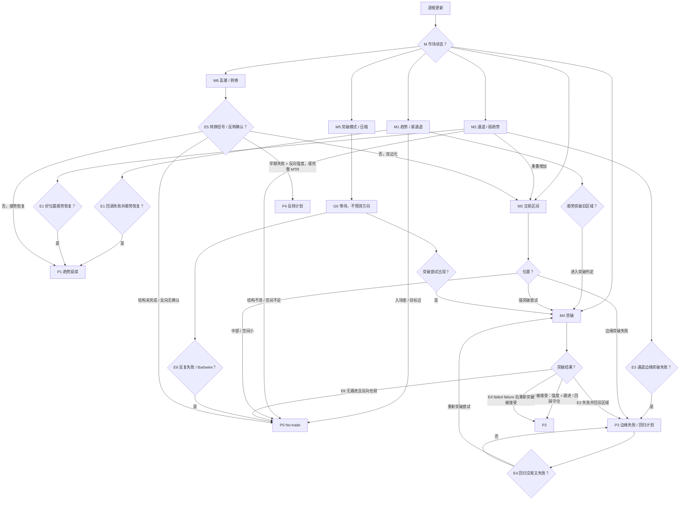
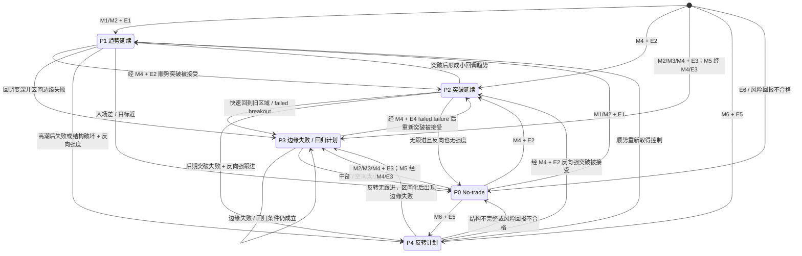

# 策略分支总图

## 总结结论

Brooks 的策略分支不是形态清单，而是从当前市场状态推导出的交易方式选择：

```text
M: Market state
-> C: Control / Location / Target filter
-> E: Event / confirmation
-> Q: Trader's Equation
-> P: Trade plan
-> G: Management
```

所有分支都必须回答同一组问题：在哪里触发，在哪里证明错误，第一目标在哪里，按 scalp、swing、TBTL 还是 no-trade 管理。

如果一个分支只能说出形态名称，却说不出触发、无效点、目标和管理方式，它仍然只是 pattern，不是 setup。

层级用于区分读图步骤：

| 层级 | 作用 | 编号 |
| --- | --- | --- |
| M 市场状态 | 判断当前 market cycle | M1 趋势 / 紧通道；M2 通道 / 弱趋势；M3 交易区间；M4 突破；M5 突破模式；M6 高潮 / 转换 |
| C 过滤层 | 判断 Always In / 控制权、位置和第一目标空间 | C1 控制权和位置支持交易；C0 位置差、目标近或控制权不清 |
| E 确认事件 | 判断触发、跟进、失败和被困交易者 | E1 回调失败并顺势恢复；E2 突破被接受；E3 突破 / 边缘测试失败；E4 failed failure；E5 转换信号 / 反转确认；E6 无跟进 / 混乱 |
| Q 交易数学 | 判断概率、风险、回报和成本是否匹配 | Q1 Trader's Equation 合格；Q0 不合格，转 no-trade |
| P 交易计划 | 决定是否交易以及交易什么 | P1 趋势延续；P2 突破延续；P3 边缘失败 / 回归计划；P4 反转计划；P0 No-trade |
| G 管理方式 | 决定出场、持有和目标 | G1 scalp；G2 small swing；G3 swing；G4 TBTL；G0 wait / exit / no-trade |

Breakout 在 Brooks 的 market cycle 中是一个转换阶段，因此 M 层保留 M4 突破。M4 表示市场正在尝试离开旧价格区域，不等于已经可以按 P2 突破延续交易。

执行上，M4 必须再由 E 事件判定结果：E2 突破被接受后才进入 P2；E3 突破失败后转 P3 / M3；E4 failed failure 后重新突破被接受才进入 P2；E6 无跟进且反向也弱时转 P0 / G0。

C 和 Q 不单独形成交易计划。它们是每个 M/E 分支进入 P 之前必须通过的过滤：控制权、位置、第一目标、结构止损和交易数学不合格时，即使 E 事件出现，也只能进入 P0 或 G0 等待。

## 顶层决策树

Mermaid 适合展示“先分流、再切换”的结构，但不适合承载所有交易细节。最稳妥的展示方式是：Mermaid 负责分支和转移，后面的表格负责入场、止损、目标和管理。

### M/C/E/Q/P/G 流程图

为了保持图可读，Mermaid 只画主要分支和转移。所有进入 P1、P2、P3、P4 的箭头，都默认必须先通过 C 过滤和 Q 交易数学；如果 C0 或 Q0，直接转 P0 / G0。



### P 交易计划转移图



```text
M 市场状态
├─ M1 趋势 / 紧通道
│  ├─ E1 回调失败并顺势恢复 -> P1 趋势延续
│  ├─ 顺势突破旧区域 -> M4 突破；E2 则 P2，E3 / E6 则 P3 / P0
│  └─ E6 入场差、目标近或无跟进 -> P0 No-trade
├─ M2 通道 / 弱趋势
│  ├─ E1 好位置顺势恢复 -> P1 趋势延续
│  ├─ E3 通道边缘突破失败 -> P3 边缘失败 / 回归计划
│  ├─ 双边交易增加 -> M3 交易区间
│  └─ E6 结构不清或空间不足 -> P0 No-trade
├─ M3 交易区间
│  ├─ 区间中部或空间不足 -> P0 No-trade
│  ├─ E3 边缘突破失败 -> P3 边缘失败 / 回归计划
│  ├─ 强突破尝试 -> M4 突破；E2 则 P2，E3 / E6 则 P3 / P0
│  └─ E4 failed failure -> M4 突破；重新突破被接受后 P2
├─ M4 突破
│  ├─ E2 强度、跟进或回踩守住 -> P2 突破延续
│  ├─ E3 快速回到旧区域 -> P3 边缘失败 / 回归计划
│  ├─ E4 failed failure 后重新突破被接受 -> P2 突破延续
│  └─ E6 无跟进且反向也弱 -> P0 No-trade
├─ M5 突破模式 / 压缩
│  ├─ 突破前 -> G0 等待
│  ├─ 突破尝试出现 -> M4 突破；E2 则 P2，E3 首次失败则 P3，E6 则 P0
│  └─ E6 反复失败 / Barbwire -> P0 No-trade
└─ M6 高潮 / 转换
   ├─ 顺势仍有跟进 -> P1；若突破旧区域，经 M4 / E2 -> P2
   ├─ E5 早期失败 + 反向强度，或完整 MTR -> P4 反转计划
   ├─ 结构未完成 / 反向无确认 -> P0 No-trade / G0 等待
   └─ E6 反向无跟进但双边化 -> M3 交易区间化
```

## 完整执行流程

实际复盘或实盘前，按这个顺序走完整流程：

1. M：先判断 market cycle。当前是趋势、通道、交易区间、突破、突破模式，还是高潮 / 转换。
2. C：再过滤控制权、位置和第一目标。方向优势不清、位置差、目标近或中部无空间时，直接转 P0 / G0。
3. E：只在 C 合格后寻找确认事件。顺势恢复、突破被接受、突破失败、failed failure 或转换信号必须有触发和跟进。
4. Q：事件出现后检查 Trader's Equation。结构止损、第一目标、概率、风险、回报和成本不匹配时，仍然转 P0。
5. P：只有 M、C、E、Q 都合格，才进入具体交易计划：P1 顺势、P2 突破延续、P3 边缘失败 / 回归、P4 反转。
6. G：交易计划成立后才决定管理方式。目标近或跟进普通，按 scalp / small swing；趋势或突破强，才考虑 swing；P4b 或反向跟进强，才考虑 TBTL。
7. 逐根更新：每根 K 线后重新检查 M、C、E、Q、P 和 G。任何一层被否定，都按转移规则降级、退出或回到 P0。

## 交易计划审计模板

每个交易计划都按同一组问题复核：

1. 当前 market cycle 和控制权是什么？
2. 这个交易计划的命题是什么？
3. 触发点在哪里，谁会入场或退出？
4. Protective stop 放在哪里，为什么那里说明想法失效？
5. 第一目标是近端目标，还是已经可以用 measured move？
6. 管理方式是 scalp、small swing、swing、TBTL，还是 no-trade？
7. 什么行为会让它转到其他分支？

### 执行优先级

交易计划判断通过后，执行上仍按同一顺序过滤：

1. 先找结构无效点，而不是先决定愿意亏多少。
2. 再找交易方向上最近、明显、现实的第一目标。
3. 只有第一目标之外仍有空间，并且跟进支持原判断，才把 measured move 当作后续目标。
4. 如果合理止损太远或第一目标太近，不用拉近止损或幻想远目标来修正数学，通常应切到 no-trade。

## P1. 趋势延续计划

分支命题：市场仍在寻找趋势方向的新价格，回调只是反方尝试，反方失败后原趋势恢复。

成立条件：

- Always In 方向清晰，趋势方仍控制市场。
- 回调较浅，或至少没有破坏原趋势结构。
- 反方信号缺乏跟进，或触发后快速失败。
- 入场方向到前高前低、量度目标或其他 magnet 仍有足够空间。

常见入口：

- H2 bull flag / L2 bear flag。
- Double bottom bull flag / double top bear flag。
- Wedge pullback。
- 小回调趋势或 micro channel 中的顺势触发。
- 反方 failed entry 后的 trapped traders。

触发和入场：通常偏 stop entry，因为交易者希望市场先证明趋势恢复。强趋势中可能出现 close entry 或 Buy The Close / Sell The Close，但代价是入场价格差、结构止损远，必须重新检查 Trader's Equation。

Protective stop：放在回调结构外，或 bull flag / bear flag 的失败位置外。若合理结构止损太远，不能硬拉近止损，应等待更小的回调结构或放弃。

目标和 measured move：

- 近端目标通常是前高前低、前 swing point、日内高低点或明显 magnet。
- 如果趋势强、回调浅并有跟进，可以用前一腿、spike、旗形高度或回调前有效运动估算 measured move。
- measured move 在强趋势延续里经常是 swing 目标，但如果前方有更近关键位，应先按近端目标管理。

管理：

- 跟进强、回调浅：保留 swing 或部分仓位。
- 跟进普通、目标近：按 scalp 或小 swing 管理。
- 触发后 entry bar 弱：降低目标或退出。
- 回调变深、双边 K 线增加：降级为通道或交易区间。

失效转移：

- 顺势触发无跟进：转 M2 或 M3，不立刻假设大反转。
- 顺势突破旧区域并被接受：经 M4 / E2 转 P2。
- 趋势高潮后结构破坏并反向跟进：转 P4。

## M2. 通道和弱趋势环境

环境命题：市场仍有方向，但趋势质量下降，顺势和逆势都开始有理由；交易必须更依赖位置、跟进和目标空间。

M2 是环境状态，不是独立交易计划。它只说明当前不能再按强趋势处理；实际执行必须进一步落到 M2 / P1 通道顺势、M2 / P3 通道逆势 scalp、M3 区间处理或 P0 no-trade。

成立条件：

- 仍有 higher high / higher low 或 lower low / lower high 的方向性。
- 回调变深，双边 K 线增加。
- 通道越紧，越接近 P1；通道越宽，越接近 M3。
- 同一个形态在通道里要比强趋势里更保守管理。

### M2 / P1. 通道顺势

条件：价格在通道内较好位置回调，原方向仍有控制权，反方信号失败。

常见语言包括 H2/L2、wedge pullback、双底牛旗或双顶熊旗。

Protective stop 放在通道内回调结构外。第一目标优先看前 swing point、通道线或近端 magnet。

Measured move 只有在通道重新收紧、顺势突破有跟进，或发展成 P1 / P2 时才提高优先级。普通宽通道里，不默认完整趋势延伸。

### M2 / P3. 通道逆势 scalp

条件：价格到达通道线、重要目标或 overshoot 后，顺势突破缺乏跟进，并出现反向强度。

常见语言包括 wedge reversal、parabolic wedge、failed breakout、final flag 失败。

Protective stop 放在 overshoot、失败突破极值或反向结构失效位置外。第一目标通常是均线、前 swing point、通道中部或最近支撑阻力。

管理以 scalp 或小 swing 为主。只有发展成更清晰的反转结构后，才考虑 TBTL 或 measured move。第一笔逆势在强通道中仍容易失败，所以必须看到反向跟进和合理目标空间。

### M2 / M3. 通道转区间

条件：回调越来越深，重叠增加，多空都能构造理由，前高前低被反复测试。

此时顺势 stop entry 优势下降，策略重心转到区间边缘、失败突破和 no-trade 过滤。

失效转移：

- 顺势恢复并重新形成浅回调：转 P1。
- 重叠增加、方向优势消失：转 M3。
- 边缘 overshoot 后反向跟进：转 P4 或 M2 / P3。

## M3. 交易区间环境

分支命题：市场围绕公平价格上下测试，多空都能赚钱，但方向延续优势下降；边缘、失败和小目标比中部追随更重要。

成立条件：

- K 线重叠多，突破后经常缺乏跟进。
- 多空信号都能出现，但都难以持续控制。
- 中部目标空间不足，边缘更容易形成结构。
- 市场行为更像 limit order market，而不是 stop order market。

执行门槛：M3 和 M5 中的交易更依赖限价思维、宽止损、分批管理和快速降级。没有成熟的 limit order / scale-in 能力时，区间中部、紧区间和 barbwire 默认应更靠近 P0，而不是强行寻找 stop entry。

### P3. 边缘失败 / 回归计划

条件：价格接近交易区间边缘、宽通道边缘、重要目标位或缺口区域，突破或测试缺乏跟进，并出现反向强度。

常见入口：

- Failed breakout。
- Failed gap。
- Wedge at edge。
- Double top / double bottom。
- Failed H2 / failed L2。
- Trapped breakout traders。

入场可以是限价思维，也可以等待收回区间后的 stop entry。Protective stop 放在失败突破极值外或边缘结构失效位置外。

第一目标通常是区间中轴；只有反向强度足够、目标空间足够时，才看另一侧边缘。Measured move 通常不是 P3 的第一目标，因为 P3 的前提是市场还没有接受离开原区域。

无效点在失败突破结构外。如果突破强且有跟进，P3 分支失效。

### P0. 区间中部 no-trade

区间中部通常没有足够优势。漂亮 signal bar、H2/L2 或小 wedge 如果出现在中部，通常只是 pattern，不是 setup。

只有在中部出现足够强的 surprise、有效突破、failed failure，或大周期关键位使当前位置不再只是小周期中部时，才重新评估是否切换分支。

### E2 / M4 / P2. 区间突破被接受

条件：价格离开区间边缘，并有强收盘、连续性、回踩守住或反方无法快速收回。

这时不再机械做回归交易，策略切换到突破延续。此时 measured move 重新变重要，常用区间高度从突破点或突破区域投射。

### E4 / M4 / P2. Failed failure 事件

条件：先出现 failed breakout，反向回归交易者入场；随后反向交易失败，价格再次强势突破并被接受。

这类分支常产生更强运动，因为先后两批交易者被迫退出。Protective stop 应放在 failed failure 结构外，目标按突破延续处理，通常优先看区间 measured move 和下一支撑阻力。

失效转移：

- 边缘失败交易无反向跟进：回到 M3 或 P0。
- 突破有跟进并守住：经 M4 / E2 转 P2。
- 强突破后又快速回到区间：回到 P3 或 P0。

## M4 / P2. 突破状态与突破延续计划

分支命题：M4 突破是 market cycle 中的转换阶段，表示市场正在尝试离开旧价格区域；P2 突破延续是只有突破被接受后才成立的交易计划。

M4 先回答“市场是否正在离开旧区域”，P2 再回答“这个离开是否已经有交易价值”。穿越价格本身只说明 breakout attempt；只有强度、跟进、回踩守住或反方无法收回足够清楚时，才是 accepted breakout。

M4 的结果分流：

- E2 突破被接受：转 P2 突破延续。
- E3 快速回到旧区域：转 P3 边缘失败 / 回归计划，或回到 M3。
- E4 failed failure 后重新突破被接受：转 P2 突破延续；没有接受则回 M3 / P0。
- E6 无跟进且反向也弱：转 P0 / G0。

M4 识别条件：

- 价格正在离开旧价格区域、区间边缘、开盘区间、趋势线、通道线、缺口或大周期支撑阻力。
- 至少出现足以吸引突破交易者的突破尝试，例如突破 K 线、连续同向 K 线、缺口、强收盘或明显离开压缩区。
- 仍需等待 E2 / E3 / E4 / E6 判定结果；M4 本身不是交易许可。

P2 成立条件：

- 突破强，收盘好，重叠少。
- 有 follow-through，或回踩守住突破点。
- 反方无法快速收回旧区域。
- 目标空间足以补偿较差入场价格和更远结构止损。

常见突破对象包括交易区间、开盘区间、前高前低、趋势线、通道线、缺口和大周期支撑阻力。

### P2.1 强突破直接延续

条件：大趋势 K 线、强收盘、较少重叠、后续跟进，反方无法快速收回。

入场可能是 stop entry、close entry 或小回调顺势入场。Protective stop 通常在突破失败位置外，但直接追突破时结构止损可能很远；如果风险回报不合格，等待 P2.2 更合理。

目标通常优先看 measured move：交易区间高度、开盘区间高度、突破腿高度、spike 高度或缺口测算。同时必须检查 measured move 前方是否有明显支撑阻力。

### P2.2 突破回踩守住

条件：突破后回踩旧边界、缺口或突破点，回踩不深，随后再次顺势触发。

这是风险回报更清晰的突破延续分支，但可能错过不给回踩的强趋势。Protective stop 放在回踩结构外或突破点失守位置外。目标继续按 P2.1 的 measured move 和下一支撑阻力评估。

### P2.3 Surprise 后第二腿

条件：突破方向出现强突破或连续趋势 K 线，明显超出预期，错过者追随，站错者退出。若 surprise 来自反向强反转 K 线，应先切到 P4 或 M3 重新评估，而不是继续按 P2 管理。

惯性不表示不会回调，而是市场常再次测试 surprise 方向。管理上要允许正常回调，但若快速回到旧区域，突破判断降级。第二腿目标常用第一腿或突破腿 measured move 估算。

### E3. 突破 / 边缘测试失败

条件：突破后没有跟进，entry bar 弱，价格快速回到旧区域。

突破追随者可能被困，分支切换为 P3 边缘失败 / 回归计划、开盘反转、failed gap 或 MTR 观察。

失效转移：

- 回踩守住并继续顺势：维持 P2。
- 突破后形成小回调趋势：转 P1。
- 快速回到旧区域：转 P3 / M3 或 P4。
- 触发后没有方向优势也没有反向强度：转 P0。

## M5. 突破模式 / 等待状态

状态命题：市场压缩或双边冲突，方向选择尚未完成；优势来自等待突破质量，而不是预测突破方向。突破模式本质上是 trading range / 压缩区的一种状态，不是已经有方向优势的趋势环境。

成立条件：

- 波动收缩、内包 K 线、三角形、tight trading range 或 barbwire。
- 多空都能构造理由，但都还没有得到市场接受。
- 首次突破经常失败，方向预期接近中性。

常见语言：

- Triangle。
- Tight trading range。
- ii / iii。
- ioi。
- oo。
- Barbwire。

触发前：通常 no-trade。突破前没有可靠方向，也通常没有合格结构止损或现实第一目标。

触发后按结果分流：

- 突破尝试出现：先进入 M4 突破，再由 E2 / E3 / E4 / E6 决定是否切到 P2 / P3 / P0。
- 首次突破失败：经 M4 / E3 切到 P3 边缘失败 / 回归计划，或按 trapped traders 处理。
- 失败后反向也失败：考虑 E4 failed failure。
- 反复重叠、目标空间小：P0 No-trade。

目标：突破前不要预设交易目标。只有突破被接受后，才用压缩区、三角形或 tight trading range 高度估算 measured move。若首次突破失败，目标回到区间中轴、压缩区另一侧或近端支撑阻力。

在突破模式里提前押方向，通常是在把 50/50 环境误读成趋势环境。

## P4. 转换和反转计划

分支命题：原趋势方开始失去控制，反方尝试建立新方向；早期概率通常不高，必须依靠结构、反向跟进和更好的风险回报。

P4 包含两个层级。P4a 是早期反转尝试：climax、wedge reversal 或 final flag 失败后出现反向强度，但结构可能还不完整，通常先按保守目标、scalp 或小 swing 处理。P4b 是更完整的 Major Trend Reversal：已经出现结构破坏、原趋势恢复失败和反向跟进，才更适合 TBTL 或反向 swing 管理。

共同前提：

- 趋势成熟、高潮、目标附近、通道后期、wedge 或 final flag 背景。
- 原趋势方最后一次推进或恢复尝试缺乏跟进。
- 反向运动至少有可见强度和目标空间。
- 结构止损、第一目标和 Trader's Equation 预先合格。

分级条件：

- P4a 早期反转尝试：末端推进失败、wedge / final flag / exhaustion 行为出现，并有反向强 K 线或连续性。此时不默认完整反向趋势，也不默认 TBTL。
- P4b 完整 MTR：原趋势线或通道结构被破坏，原趋势恢复尝试失败，形成 higher high、lower high、lower low 或 higher low 变体，并有反向跟进。

### P4.1 高潮后等待

高潮不是反转信号。第一笔逆势交易经常只是回调，尤其是趋势仍强、没有结构破坏、没有回探失败时。

如果高潮后仍有顺势跟进，分支先回到 P1；若顺势运动突破旧区域并被接受，再经 M4 / E2 转 P2。

### P4.2 Major Trend Reversal

需要组合条件：

- 成熟趋势。
- 趋势线或通道结构被破坏。
- 原趋势恢复尝试失败。
- 形成 higher high、lower high、lower low 或 higher low 变体。
- 反向运动有跟进和目标空间。

Protective stop 放在回探失败极值外，或反转结构被否定的位置外。MTR 早期通常不是高概率交易。更保守的第一目标是均线、前 swing point、区间中轴或 TBTL，而不是立刻期待完整反向趋势。

### P4.3 早期 Wedge / Final flag 失败

Wedge reversal、parabolic wedge 和 final flag 的共同点是：原趋势方最后一次推进或整理后缺乏跟进，顺势交易者被困。这类机会通常先归入 P4a。

交易意义来自失败和反向强度，而不是 wedge 或 flag 名称本身。

### P4.4 TBTL 管理

反转成功后，市场常先进入交易区间或两腿调整。TBTL 是更保守的 swing 预期，用来避免第一两根反向 K 线后就过早否定交易，也避免直接幻想新趋势。

目标和 measured move：

- 早期反转先看近端目标：均线、前 swing point、区间中轴、原突破点。
- 反向跟进强，才看 TBTL、反向 measured move 或更大 swing。
- 如果反转无跟进，先按 trading range 处理，而不是坚持新趋势。

失效转移：

- 原趋势重新取得控制：转 P1；若突破旧区域并被接受，经 M4 / E2 转 P2。
- 反转触发后无跟进：转 M3 或 P0。
- 反向强突破并被接受：经 M4 / E2 转 P2 的反向版本。

## 缺口、开盘和交易日类型叠加层

时段和缺口不是独立策略，它们改变前面分支的概率、目标和跟进要求。

| 场景 | 优先观察 | 编号映射 |
| --- | --- | --- |
| Trend from the open | 早期强突破、浅回调、反方失败 | P1 / M4 / P2 |
| Opening range breakout | 突破开盘区间后是否有跟进 | M4 / P2；失败则 P3 / P4 |
| Opening reversal | 早期运动进入关键位置后失败 | P3 / P4 |
| Gap accepted | 缺口方向有跟进，回补失败 | M4 / P2 / P1 |
| Failed gap | 缺口方向无跟进，回到原区域 | P3 / P4 |
| Exhaustion gap | 趋势后期缺口强但无跟进 | P4 |
| Trading range day | 中部无优势，边缘和失败重要 | P3 / P0 |
| Reversal day | 第一波运动被否定，反向有跟进 | P4 / M3 |
| Breakout day | 离开旧区域并被市场接受 | M4 / P2 |

收盘前还要检查剩余时间。目标再合理，如果时间不足，也可能降级为 scalp 或 no-trade。

## 形态路由表

同一个形态必须根据分支重新解释：

| 形态语言 | 趋势环境 | 区间环境 | 转换环境 |
| --- | --- | --- | --- |
| H2 / L2 | 顺势回调延续 | 中部通常无优势；边缘朝区间内部才有意义 | 失败的 H2 / L2 可能形成 trapped traders |
| Wedge | Wedge pullback 可顺势 | 边缘三推可支持回归交易 | 趋势后期可支持 reversal / TBTL |
| Double top / bottom | Double top bear flag / double bottom bull flag | 边缘第二次测试失败可支持回归交易 | 回探极值失败可成为 MTR 组件 |
| Final flag | 仍强时只是延续整理 | 可能只是小区间 | 顺势突破失败后才有反转意义 |
| Triangle / ii / ioi / oo | 可能是趋势中的暂停 | 多数属于 breakout mode | 首次突破失败可触发陷阱 |
| Gap | Body gap / micro gap 可显示惯性 | 区间边缘无跟进可失败 | Exhaustion gap 需等待拒绝继续 |
| Trend bar | 需要连续性确认趋势 | 边缘强 K 线可能是 vacuum test | 反向强 K 线只是反转尝试，需跟进 |

## 止损和目标定位

止损和目标不是入场后的补丁，而是 setup 成立前必须先能说明的结构条件。

基本顺序：

1. 先确定交易想法在哪里失效。
2. 再确定第一目标是否真实可达。
3. 最后用概率、风险、回报和成本判断是否值得交易。

如果合理止损太远，不能随意把止损拉近；如果第一目标太近，不能为了满足风险回报随意幻想远目标。这两种情况通常都应切到 no-trade，或等待更好的入场结构。

### Protective stop 怎么定

Protective stop 应放在“如果价格到达这里，原交易想法已经被市场否定”的位置外侧，而不是任意点数。

几种 stop 管理不要混在一起：

- Signal-bar stop：常见于 stop entry 或反转入场，止损放在 signal bar 外侧，风险较清楚但可能太近。
- Structure stop：放在回调、失败突破、回踩或反转结构外侧，更贴近交易命题的失效点。
- Wide stop / scaling-in：用更远止损和加仓提高存活率，通常只适合经验足够、仓位更小且最大风险预先固定的交易者。

无论使用哪一种，止损都必须服务于交易命题。不能为了得到漂亮的 R 倍数，把止损放在正常波动内。

常见锚点：

- 趋势延续：回调结构外侧，或 bull flag / bear flag 的失败位置外侧。
- 通道顺势：通道内回调结构外侧；通道逆势则放在 overshoot 或失败突破结构外侧。
- P3 边缘失败 / 回归：失败突破的极值外侧，或区间边缘测试失败结构外侧。
- 突破延续：突破失败位置外侧，或回踩突破点后形成的回踩结构外侧。
- 突破模式：突破前通常没有合格止损；等突破尝试、回踩或失败结构出现后，先经 M4 判定，再按 P2 / P3 / P0 定位。
- 反转 / MTR：回探失败的高点或低点外侧，或反转结构被否定的位置外侧。

止损太近容易被正常波动扫出；止损太远会破坏 Trader's Equation。结构止损如果不合算，问题通常不是止损位置，而是这笔交易不该做。

### 第一目标怎么定

第一目标应是交易方向上最近、明显、现实的目标区域。目标是区域，不是保证到达的精确价格。

目标定位可以分两层：

1. 近端目标：最近的前高前低、区间中轴、均线、突破点、缺口或大周期关键位。
2. 量度目标：用前一腿、区间高度、突破高度、开盘区间、压缩区或缺口估算更远的目标区域。

执行上应先按近端目标过滤风险回报，再决定是否保留部分仓位看 measured move。不能因为图上存在远端 measured move，就忽略中途更近的前高前低、区间中轴、均线、整数位或大周期关键位。

Brooks 语境里 measured move 非常常用，尤其适合趋势、突破、缺口被接受和 swing 管理。但如果近端目标已经压缩空间，量度目标不能被拿来强行证明交易值得做。

常见目标来源：

- 前高、前低、日内高低点、昨日高低点。
- 交易区间中轴或另一侧边缘。
- 突破点回探、缺口、开盘区间高低点。
- 均线、趋势线、通道线。
- 大整数位、视觉价位和大周期支撑阻力。
- 量度目标。

目标近、波动双边、环境偏区间时，更像 scalp。目标远、趋势或突破有跟进时，才更像 swing。反转成功后，先用均线、前 swing point、区间中轴或 TBTL 作保守目标，比直接期待完整新趋势更符合 Brooks 语境。

### 量度目标怎么估

量度目标不是单一公式，而是把已经被市场认可的结构投射到后续价格上。

常见用法：

- 交易区间突破：用区间高度从突破点或突破区域投射。
- 开盘区间突破：用 opening range 高低点高度估算后续目标。
- 趋势延续：用前一腿、spike、旗形或回调前的有效运动估算下一腿。
- 缺口延续：用缺口、突破腿或 measuring gap 辅助估算目标。
- 突破模式：用三角形、tight trading range 或压缩区高度估算，但只有突破被接受后才有意义。
- 反转成功：先看近端目标；只有反向跟进强，才把量度目标作为后续 swing 目标。

使用限制：

- 量度目标必须和 follow-through 配合。没有跟进的突破，量度目标只是未被确认的投射。
- 量度目标前方如果有明显支撑阻力，应先按近端目标管理。
- P3 边缘失败 / 回归交易的第一目标通常不是量度目标，而是区间中轴；只有经 M4 判定突破或 failed failure 被接受后，量度目标才重新变重要。
- 到达量度目标不等于必须反转，只说明市场测试了一个明显价格区域。

### 编号定位表

| 编号 | Protective stop 锚点 | 第一目标 | 后续目标条件 | 概率 / 收益特征 |
| --- | --- | --- | --- | --- |
| P1 趋势延续 | 回调结构外、旗形失败位置外 | 前高前低、最近 magnet；强趋势可把前一腿 measured move 作为 swing 目标 | 跟进强且回调浅，才看更远量度目标、趋势延伸或跟踪目标 | 方向概率较好，但追得晚会牺牲风险回报 |
| M2 / P1 通道顺势 | 通道内回调结构外 | 前 swing point、通道线、近端 magnet | 通道收紧或顺势突破有跟进，才提高到趋势目标 | 中等概率，回报常被通道结构限制 |
| M2 / P3 通道逆势 | overshoot 或失败突破结构外 | 均线、前 swing point、通道中部 | 只有形成清晰反转结构后，才考虑 TBTL | 逆势早期概率有限，主要靠好位置和小目标 |
| P3 边缘失败 / 回归计划 | 失败突破极值外、区间边缘结构外 | 区间中轴 | 反向强度足够且空间足够，才看另一侧边缘 | 优势来自边缘和失败，默认不是远目标交易 |
| M4 突破尝试 | 确认前不预设；接受后按 P2，失败后按 P3 | 确认前无交易目标；接受后看 measured move 或下一支撑阻力 | E2 被接受才进入 P2；E3 失败则转 P3；E4 后重新突破被接受才转 P2 | 转换状态，不是自动交易计划 |
| E4 / M4 / P2 Failed failure | failed failure 结构外 | 区间 measured move、下一支撑阻力 | 按突破延续管理，快速回旧区则退出或反向评估 | 二阶失败可增强动能，但必须快速证明 |
| P2 突破延续 | 突破失败位置外、回踩结构外 | 区间高度、突破腿、开盘区间或缺口形成的 measured move；同时检查下一支撑阻力 | 突破后小回调趋势成立，才保留 swing 或跟踪目标 | 强突破概率高，但入场和止损通常更差 |
| M5 突破模式 | 突破前不预设；突破尝试出现后先经 M4 判定 | 突破前无交易目标；M4 / E2 后按 P2，M4 / E3 后按 P3，E6 后按 P0 | 只有突破被接受，才用压缩区高度估 measured move | 突破前接近中性，优势在等待确认 |
| P4 反转计划 | 回探失败极值外、反转结构失效位置外 | 均线、前 swing point、区间中轴 | P4a 先看小目标；P4b 或反向跟进强，才看 TBTL 或更大 swing | 早期概率偏低，需要更好目标空间或后续强突破 |
| P0 No-trade | 无清晰结构止损 | 无现实目标 | 等待分支重新变清楚 | Trader's Equation 不合格 |

### 风险回报检查

入场前至少问：

1. 结构止损到入场的距离是多少？
2. 第一目标到入场的距离是多少？
3. 这笔交易是靠高概率小目标，还是靠较低概率大目标？
4. 附近支撑阻力、时段或大周期目标是否压缩空间？
5. 如果只能靠移动止损或扩大目标来让数学好看，是否应该放弃？

Swing 通常需要潜在回报显著大于风险，或至少有足够概率补偿风险。Scalp 可以目标更近，但必须有更现实的命中条件、执行质量和退出计划。

## 管理矩阵

| 编号 | 常见入场 | Protective stop | 第一目标 | 默认管理 |
| --- | --- | --- | --- | --- |
| P1 趋势延续 | Stop entry，强势 close entry，小回调触发 | 回调结构外 | 前高前低；强趋势可用 measured move | G3 swing 或 G2 small swing；跟进弱则降级 |
| M2 / P1 通道顺势 | 好位置顺势 stop entry | 通道回调结构外 | 前 swing point、通道线、近端 magnet | G2 small swing；不默认完整趋势延伸 |
| M2 / P3 通道逆势 | 边缘失败后的反向触发 | overshoot 或失败突破结构外 | 均线、前 swing point、通道中部 | G1 scalp / G2 small swing |
| P3 边缘失败 / 回归计划 | 边缘 limit entry，或收回区间后的 stop entry | 失败突破极值外 | 区间中轴 | G1 scalp；强反向才看另一侧 |
| M4 突破尝试 | 等待 E2/E3/E4 判定 | 确认后按 P2/P3 定位 | 确认前无目标 | G0 等待；确认后切 P2/P3/P0 |
| E4 / M4 / P2 Failed failure | 反向回归交易失败后的再突破 | failed failure 结构外 | 区间 measured move、下一支撑阻力 | 按 P2 管理 |
| P2 突破延续 | Stop entry，close entry，回踩守住再触发 | 突破失败位置或回踩结构外 | measured move、下一支撑阻力 | G3 swing；快速回旧区则退出或反向评估 |
| M5 突破模式 | 等待突破尝试或失败确认 | 突破前不预设 | 突破前无目标；被接受后看压缩区 measured move | G0 等待；突破尝试先切 M4，再落到 P2/P3/P0 |
| P4 反转计划 | 回探失败后的反向触发 | 反转结构被否定的位置外 | 均线、前 swing point、区间中轴 | P4a 用 G1/G2；P4b 才用 G4 TBTL / 保守 swing |
| P0 No-trade | 无 | 无 | 无 | G0 等待新信息 |

## P0. No-trade 计划

No-trade 不是没有判断，而是 Trader's Equation 不合格。

常见条件：

- 区间中部。
- C0：控制权不清、位置差或第一目标空间不足。
- Q0：结构止损、第一目标、概率、风险、回报和成本不匹配。
- Barbwire 或 tight trading range 空间太小。
- 方向判断和目标空间冲突。
- 合理止损太远。
- 触发后没有跟进，但反向也没有强度。
- 多周期冲突导致风险回报不清。
- 低流动性或收盘前目标不可达。
- 需要堆很多理由才能证明交易成立。

等待的目标是让市场把分支重新变清楚：要么强突破，要么边缘失败，要么反向跟进，要么继续无优势。

## 逐根更新规则

每根 K 线后只问五件事：

1. M 状态有没有改变，是否从趋势降级为通道、区间或转换？
2. C 过滤是否仍合格，控制权、位置和目标空间有没有变差？
3. E 事件有没有跟进；如果没有，失败后谁被困？
4. Q 交易数学是否仍合格，结构止损和第一目标是否还匹配？
5. P / G 是否需要降级、退出、转移到其他计划，或回到 P0？

常见转移规则：

- 趋势延续无跟进，先降级为通道或交易区间，不立刻假设大反转。
- P3 回归交易遇到强突破和跟进，经 M4 / E2 切到突破延续，不继续机械回归。
- 突破延续快速回到旧区域，切到 failed breakout / trapped traders。
- 反转尝试无跟进，先按 trading range 处理，而不是坚持新趋势。
- 任何交易计划只要止损、目标、概率和管理不匹配，都切到 P0 no-trade。
